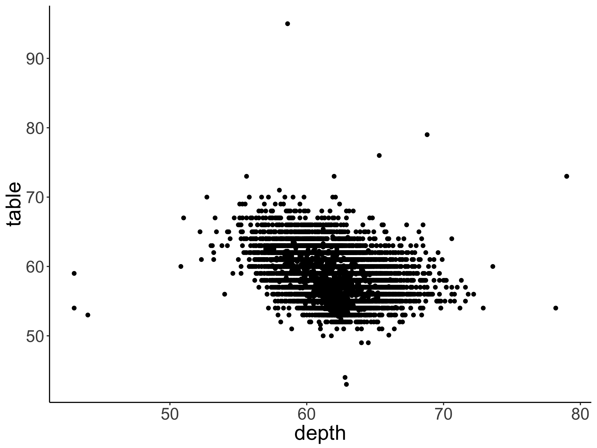
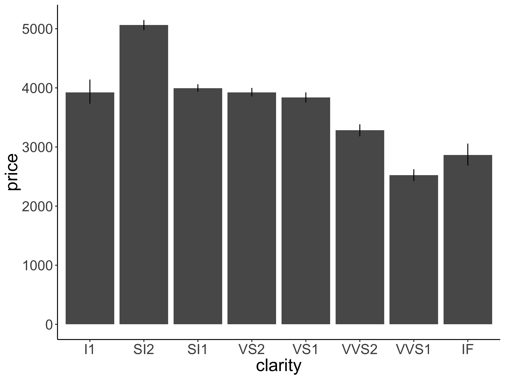
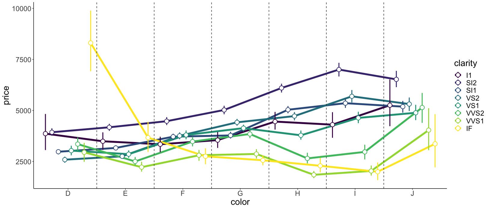

# Visualization 1: Exercise solutions 

## Load packages and set theme 

Let's first load the packages that we need for this chapter. 

```{r load_packages, message=FALSE}
library("knitr")     # for rendering the RMarkdown file
library("tidyverse") # for data wrangling 
```

Let's set the plotting theme. 

```{r plotting_theme}
theme_set(theme_classic() + #set the theme 
    theme(text = element_text(size = 20))) #set the default text size
```

Let's load the diamonds data set 


```{r}
df.diamonds = diamonds 
```

## Practice plot 1

Recreate the plot shown in Figure \@ref(fig:practice-plot1).

```{r fig.align="center", fig.cap="Practice plot 1.", fig.height=6, fig.width=8, out.width="95%"}
ggplot(data = df.diamonds,
       mapping = aes(x = depth,
                     y = table)) +
  geom_point()
```

```{r practice-plot1, out.width="90%", fig.align="center", fig.cap="Practice plot 1."}

```
Recreate the plot shown in Figure \@ref(fig:practice-plot1a).

```{r fig.align="center", fig.cap="Practice plot 1 (advanced).", fig.height=6, fig.width=8, out.width="95%"}
ggplot(data = df.diamonds,
       mapping = aes(x = depth,
                     y = table)) +
  geom_point(alpha = 0.1) + 
  labs(x = "Depth (in mm)",
       y = "Table\n(width of top of diamond relative to widest point)")
```
```{r practice-plot1a, out.width="90%", fig.align="center", fig.cap="Practice plot 1 (advanced)."}
include_graphics("figures/vis1_practice_plot1a.png")
```

## Practice plot 2

Recreate the plot shown in Figure \@ref(fig:practice-plot2).

```{r fig.height=6, fig.width=8}
ggplot(data = df.diamonds,
       mapping = aes(x = clarity,
                     y = price)) +
  stat_summary(fun = "mean",
               geom = "bar") +
  stat_summary(fun.data = "mean_cl_boot",
               geom = "linerange")
```

```{r practice-plot2, out.width="90%", fig.align="center", fig.cap="Practice plot 2."}

```
Recreate the plot shown in Figure \@ref(fig:practice-plot2a).

```{r fig.height=6, fig.width=8}
ggplot(data = df.diamonds,
       mapping = aes(x = clarity,
                     y = price)) +
  stat_summary(fun = "mean",
               geom = "bar",
               color = "black",
               fill = "lightblue") +
  stat_summary(fun.data = "mean_cl_boot",
               geom = "linerange",
               linewidth = 1) +
  scale_y_continuous(expand = expansion(mult = c(0, 0.1)))
```

```{r practice-plot2a, out.width="90%", fig.align="center", fig.cap="Practice plot 2 (advanced).", echo=F}
include_graphics("figures/vis1_practice_plot2a.png")
```

## Practice plot 3

Recreate the plot shown in Figure \@ref(fig:practice-plot3).

```{r fig.height=6, fig.width=8}
ggplot(data = df.diamonds, 
       mapping = aes(x = color,
                     y = price,
                     group = clarity,
                     color = clarity)) +
  stat_summary(fun.data = "mean_cl_boot",
               geom = "linerange",
               linewidth = 1) + 
  stat_summary(fun = "mean",
               geom = "line",
               linewidth = 2)
```

```{r practice-plot3, out.width="90%", fig.align="center", fig.cap="Practice plot 3.", echo=F}
include_graphics("figures/vis1_practice_plot3.png")
```

Recreate the plot shown in Figure \@ref(fig:practice-plot3a).

```{r fig.height=6, fig.width=14}
ggplot(data = df.diamonds, 
       mapping = aes(x = color,
                     y = price,
                     group = clarity,
                     color = clarity)) +
  stat_summary(fun = "mean",
               geom = "line",
               linewidth = 2,
               position = position_dodge(width = 0.9)) + 
  stat_summary(fun.data = "mean_cl_boot",
               geom = "pointrange",
               shape = 21, 
               fill = "white",
               size = 1,
               position = position_dodge(width = 0.9)) + 
  geom_vline(xintercept = seq(from = 1.5,
                              by = 1,
                              length.out = 6),
             linetype = 2,
             color = "gray20")
```

```{r practice-plot3a, out.width="90%", fig.align="center", fig.cap="Practice plot 3 (advanced).", echo=F}

```

## Practice plot 4

Recreate the plot shown in Figure \@ref(fig:practice-plot4).

```{r fig.height=6, fig.width=8}
ggplot(data = df.diamonds,
       mapping = aes(x = color,
                     y = price,
                     fill = cut)) +
  stat_summary(fun = "mean",
               geom = "bar",
               position = position_dodge(width = 0.9),
               color = "black") +
  stat_summary(fun.data = "mean_cl_boot",
               geom = "linerange",
               position = position_dodge(width = 0.9),
               color = "black") +
  facet_grid(rows = vars(clarity)) +
  theme(axis.text.y = element_text(size = 8),
        strip.text = element_text(size = 10))
```

```{r practice-plot4, out.width="90%", fig.align="center", fig.cap="Practice plot 4.", echo=F}
include_graphics("figures/vis1_practice_plot4.png")
```

