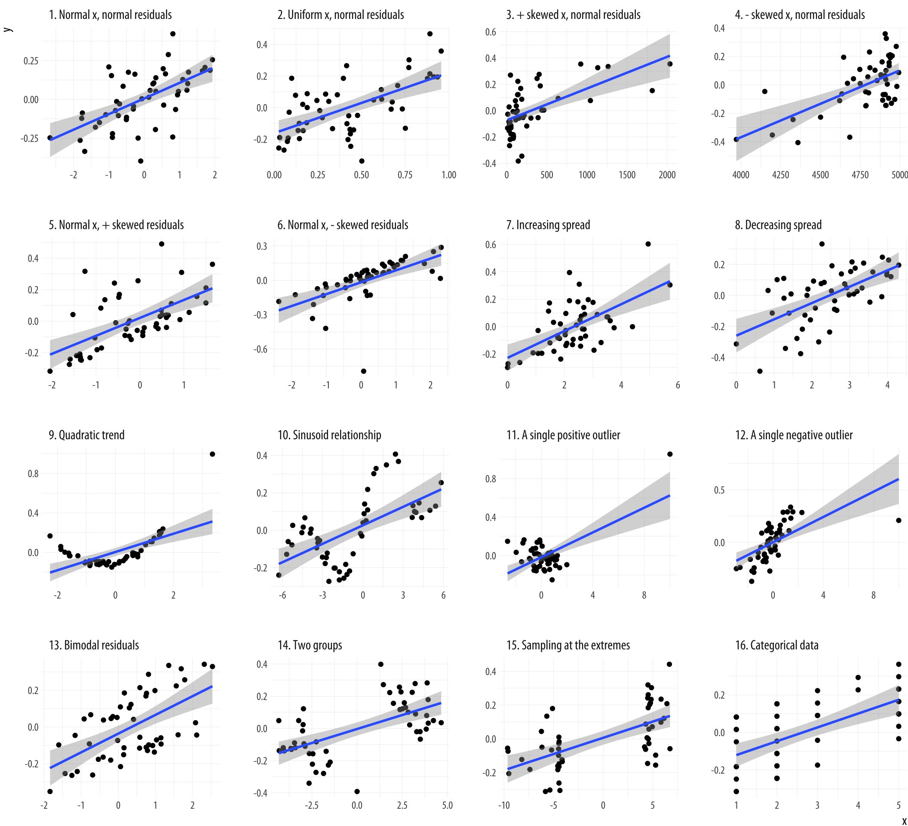
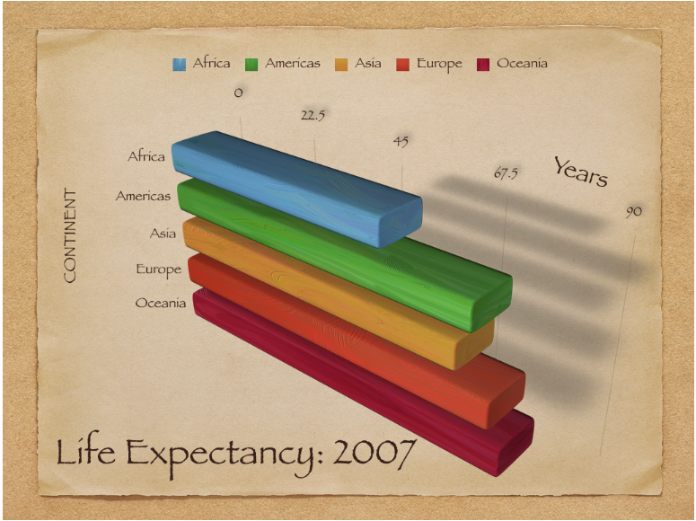
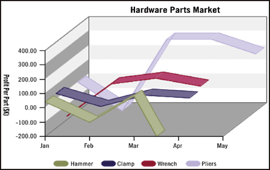
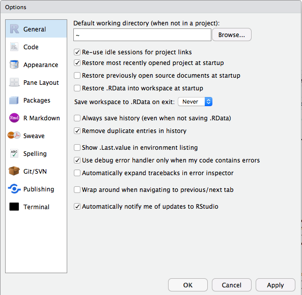
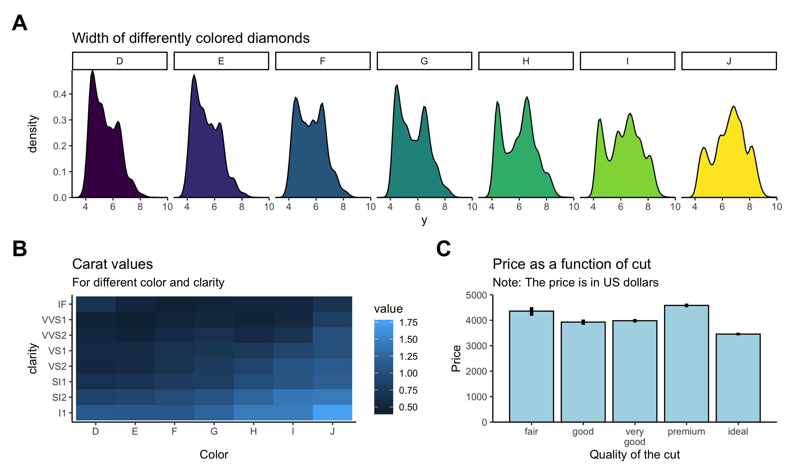

```{r packages, eval=F}
install.packages(c("bookdown","knitr","tidyverse", "devtools", "tinytex", "Hmisc"))
```

```{r setup, include=FALSE}
# these options here change the formatting of how comments are rendered
knitr::opts_chunk$set(
  collapse = TRUE,
  comment = "#>",
  results = "hold",
  fig.show = "hold")
```

# Visualization 1

In this lecture, we will take a look at how to visualize data using the powerful [ggplot2](https://ggplot2.tidyverse.org/) package. We will use `ggplot2` a lot throughout the rest of the course! 

## Learning goals 

- Get familiar with the RStudio interface.
- Take a look at some suboptimal plots, and think about how to make them better.
- Understand the general philosophy behind `ggplot2` -- a grammar of graphics. 
- Understand the mapping from data to geoms in `ggplot2`.
- Create informative figures using grouping and facets. 

## Load packages

Let's first load the packages that we need for this chapter.

```{r visualization1-01, message=FALSE}
library("knitr")     # for rendering the RMarkdown file
library("tidyverse") # for plotting (and many more cool things we'll discover later)
```

The `tidyverse` is a collection of packages that includes `ggplot2`.

## Why visualize data?

> The greatest value of a picture is when it forces us to notice what we never expected to see. — John Tukey

> There is no single statistical tool that is as powerful as a well‐chosen graph. [@chambers1983graphical]

> ...make __both__ calculations __and__ graphs. Both sorts of output should be studied; each will contribute to understanding. [@anscombe1973american]

```{r visualization1-02, echo=FALSE, fig.cap="Anscombe's quartet.", out.width="95%"}
include_graphics("figures/anscombe.png")
```

Anscombe's quartet in Figure \@ref(fig:visualization1-02) (left side) illustrates the importance of visualizing data. Even though the datasets I-IV have the same summary statistics (mean, standard deviation, correlation), they are importantly different from each other. On the right side, we have four data sets with the same summary statistics that are very similar to each other.

```{r visualization1-03, echo=FALSE, fig.cap= "The Pearson's $r$ correlation coefficient is the same for all of these datasets. Source: [Data Visualization -- A practical introduction by Kieran Healy](http://socviz.co/lookatdata.html#lookatdata)", out.width="95%"}

```

All the datasets in Figure \@ref(fig:visualization1-03) share the same correlation coefficient. However, again, they are very different from each other.

```{r visualization1-04, echo=FALSE, fig.cap="__The Datasaurus Dozen__. While different in appearance, each dataset has the same summary statistics to two decimal places (mean, standard deviation, and Pearson's correlation).", out.width="95%"}
include_graphics("figures/datasaurus_dozen.png")
```

The data sets in Figure \@ref(fig:visualization1-04) all share the same summary statistics. Clearly, the data sets are not the same though.

> __Tip__: Always plot the data first!

[Here](https://www.autodeskresearch.com/publications/samestats) is the paper from which I took Figure \@ref(fig:visualization1-02) and \@ref(fig:visualization1-04). It explains how the figures were generated and shows more examples for how summary statistics and some kinds of plots are insufficient to get a good sense for what's going on in the data.

```{r visualization1-05, echo=FALSE, fig.cap="Animation showing different data sets that all share the same summary statistics.", out.width="95%"}
include_graphics("figures/data_dino.gif")
```

### How _not_ to visualize data

Below are some examples of visualizations that could be improved. How would you make them better?

```{r visualization1-06, echo=FALSE, out.width='90%', fig.align='center', fig.cap="Example of a bad plot. Source: [Data Visualization -- A practical introduction by Kieran Healy](http://socviz.co/lookatdata.html#lookatdata)", out.width="95%"}

```

```{r visualization1-07, echo=FALSE, out.width='90%', fig.align='center', fig.cap="Another bad plot. Source: Google image search for 'bad graphs'", out.width="95%"}

```

```{r visualization1-08, echo=FALSE, out.width='90%', fig.align='center', fig.cap="And another one. Source: [Bad graph wall of shame](http://bcuchta.com/wall_of_shame/)", out.width="95%"}
include_graphics("figures/bad_plot3.png")
```

```{r visualization1-09, echo=FALSE, out.width='90%', fig.align='center', fig.cap="And another one. Source: [Bad graph wall of shame](http://bcuchta.com/wall_of_shame/)", out.width="95%"}

```

```{r visualization1-10, echo=FALSE, out.width='90%', fig.align='center', fig.cap="And another one. Source: [Bad graph wall of shame](http://bcuchta.com/wall_of_shame/)", out.width="95%"}

```

```{r visualization1-11, echo=FALSE, out.width='90%', fig.align='center', fig.cap="The last one for now. Source: [Bad graph wall of shame](http://bcuchta.com/wall_of_shame/)", out.width="95%"}
include_graphics("figures/bad_plot6.png")
```

### How to make it better

In this class, we you will learn how to use `ggplot2` to make nice figures. The `ggplot2` library provides a unified framework for making plots -- it defines a grammar of graphics according to which we construct figures step by step.

Instead of learning rigid rules for what makes for a good figure, you will learn how to make figures yourself, play around with things, and get a feeling for what works best.

## Setting up RStudio

```{r visualization1-12, out.width='100%', echo=FALSE, fig.cap="General preferences.", out.width="95%"}

```

__Make sure that__:

- Restore .RData into workspace at startup is _unselected_
- Save workspace to .RData on exit is set to _Never_

```{r visualization1-13, out.width='100%', echo=FALSE, fig.cap="Code window preferences.", out.width="95%"}
include_graphics("figures/r_preferences_code.png")
```

__Make sure that__:

- Soft-wrap R source files is _selected_

This way you don't have to scroll horizontally. At the same time, avoid writing long single lines of code. For example, instead of writing code like so:

```{r visualization1-14, eval=FALSE}
ggplot(data = diamonds, mapping = aes(x = cut, y = price)) +
  stat_summary(fun.y = "mean", geom = "bar", color = "black", fill = "lightblue", width = 0.85) +
  stat_summary(fun.data = "mean_cl_boot", geom = "linerange", size = 1.5) +
  labs(title = "Price as a function of quality of cut", subtitle = "Note: The price is in US dollars", tag = "A", x = "Quality of the cut", y = "Price")
```

You may want to write it this way instead:

```{r visualization1-15, eval=FALSE}
ggplot(data = diamonds, 
       mapping = aes(x = cut, y = price)) +
  # display the means
  stat_summary(fun.y = "mean",
               geom = "bar",
               color = "black",
               fill = "lightblue",
               width = 0.85) +
  # display the error bars
  stat_summary(fun.data = "mean_cl_boot",
               geom = "linerange",
               size = 1.5) +
  # change labels
  labs(title = "Price as a function of quality of cut",
       subtitle = "Note: The price is in US dollars", # we might want to change this later
       tag = "A",
       x = "Quality of the cut",
       y = "Price")
```

This makes it much easier to see what's going on, and you can easily add comments to individual lines of code.

>__Tip__: If a function has more than two arguments put each argument on a new line.

RStudio makes it easy to write nice code. It figures out where to put the next line of code when you press `ENTER`. And if things ever get messy, just select the code of interest and hit `cmd + i` to re-indent the code.

Here are some more resources with tips for how to write nice code in R:

- [Advanced R style guide](http://adv-r.had.co.nz/Style.html)

>__Tip__: Use a consistent coding style. This makes reading code and debugging much easier! 

## Getting help

There are three simple ways to get help in R. You can either put a `?` in front of the function you'd like to learn more about, or use the `help()` function.

```{r visualization1-16, eval=FALSE}
?print
help("print")
```

>__Tip__: To see the help file, hover over a function (or dataset) with the mouse (or select the text) and then press `F1`.

I recommend using `F1` to get to help files -- it's the fastest way!

R help files can sometimes look a little cryptic. Most R help files have the following sections (copied from [here](https://www.dummies.com/programming/r/r-for-dummies-cheat-sheet/)):

---

__Title__: A one-sentence overview of the function.

__Description__: An introduction to the high-level objectives of the function, typically about one paragraph long.

__Usage__: A description of the syntax of the function (in other words, how the function is called). This is where you find all the arguments that you can supply to the function, as well as any default values of these arguments.

__Arguments__: A description of each argument. Usually this includes a specification of the class (for example, character, numeric, list, and so on). This section is an important one to understand, because arguments are frequently a cause of errors in R.

__Details__: Extended details about how the function works, provides longer descriptions of the various ways to call the function (if applicable), and a longer discussion of the arguments.

__Value__: A description of the class of the value returned by the function.

__See also__: Links to other relevant functions. In most of the R editors, you can click these links to read the Help files for these functions.

__Examples__: Worked examples of real R code that you can paste into your console and run.

---

Here is the help file for the `print()` function:

```{r visualization1-17, echo=FALSE, fig.cap="Help file for the print() function.", out.width="95%"}
  include_graphics("figures/help_print.png")
```

## Data visualization using `ggplot2`

We will use the `ggplot2` package to visualize data. By the end of next class, you'll be able to make a figure like this:

```{r visualization1-18, echo=FALSE, fig.cap="What a nice figure!", out.width="95%"}
  
```

Now let's figure out how to get there.

### Setting up a plot

Let's first get some data.

```{r visualization1-19}
df.diamonds = diamonds
```

The `diamonds` dataset comes with the `ggplot2` package. We can get a description of the dataset by running the following command:

```{r visualization1-20, eval=FALSE}
?diamonds
```

Above, we assigned the `diamonds` dataset to the variable `df.diamonds` so that we can see it in the data explorer.

Let's take a look at the full dataset by clicking on it in the explorer.

>__Tip__: You can view a data frame by highlighting the text in the editor (or simply moving the mouse above the text), and then press `F2`.

The `df.diamonds` data frame contains information about almost 60,000 diamonds, including their `price`, `carat` value, size, etc. Let's use visualization to get a better sense for this dataset.

We start by setting up the plot. To do so, we pass a data frame to the function `ggplot()` in the following way.

```{r visualization1-21}
ggplot(data = df.diamonds)
```

This, by itself, won't do anything yet. We also need to specify what to plot.

Let's take a look at how much diamonds of different color cost. The help file says that diamonds labeled D have the best color, and diamonds labeled J the worst color. Let's make a bar plot that shows the average price of diamonds for different colors.

We do so via specifying a mapping from the data to the plot aesthetics with the function `aes()`. We need to tell `aes()` what we would like to display on the x-axis, and the y-axis of the plot.

```{r visualization1-22}
ggplot(data = df.diamonds,
       mapping = aes(x = color, y = price))
```

Here, we specified that we want to plot `color` on the x-axis, and `price` on the y-axis. As you can see, `ggplot2` has already figured out how to label the axes. However, we still need to specify _how_ to plot it. Let's make a __bar graph__:

```{r visualization1-23}
ggplot(data = df.diamonds,
       mapping = aes(x = color, y = price)) +
  stat_summary(fun.y = "mean", geom = "bar")
```

Neat! Three lines of code produce an almost-publication-ready plot (to be published in the _Proceedings of Unnecessary Diamonds_)! Note how we used a `+` at the end of the first line of code to specify that there will be more. This is a very powerful idea underlying `ggplot2`. We can start simple and keep adding things to the plot step by step.

We used the `stat_summary()` function to define _what_ we want to plot (the "mean"), and _how_ (as a "bar" chart). Let's take a closer look at that function.

```{r visualization1-24, eval=FALSE}
help(stat_summary)
```

Not the the easiest help file ... We supplied two arguments to the function, `fun.y = ` and `geom = `.

1. The `fun.y` argument specifies _what_ function we'd like to apply to the data for each value of `x`. Here, we said that we would like to take the `mean` and we specified that as a string.
2. The `geom` (= geometric object) argument specifies _how_ we would like to plot the result, namely as a "bar" plot.

Instead of showing the "mean", we could also show the "median" instead.

```{r visualization1-25}
ggplot(data = df.diamonds, mapping = aes(x = color, y = price)) +
  stat_summary(fun.y = "median", geom = "bar")
```

And instead of making a bar plot, we could plot some points.

```{r visualization1-26}
ggplot(df.diamonds, aes(x = color, y = price)) +
  stat_summary(fun.y = "mean", geom = "point")
```

>__Tip__: Take a look [here](https://ggplot2.tidyverse.org/reference/#section-layer-geoms) to see what other geoms ggplot2 supports.

Somewhat surprisingly, diamonds with the best color (D) are not the most expensive ones. What's going on here? We'll need to do some more exploration to figure this out.

Note that in the last plot, I removed the `data = ` and `mapping = ` specifiers. These keywords are optional, and as long as we provide the arguments to the function in the correct order, we are ok. So, the following doesn't work:

```{r visualization1-27, eval=F}
ggplot(aes(x = color, y = price), df.diamonds) +
  stat_summary(fun.y = "mean", geom = "point")
```

While this works:

```{r visualization1-28}
ggplot(mapping = aes(x = color, y = price), data = df.diamonds) +
  stat_summary(fun.y = "mean", geom = "point")
```

In general, it's good practice to include the argument specifiers -- particularly for functions that are not used all the time. If the same function is used multiple times throughout the script, I would suggest to use the specifiers first, and then it's ok to drop them later.

### Setting the default plot theme

Before moving on, let's set a different default theme for our plots. Personally, I'm not a big fan of the gray background and the white grid lines. Also, the default size of the text should be bigger. We can change the default theme using the `theme_set()` function like so:

```{r visualization1-29}
theme_set(theme_classic() + # set the theme
            theme(text = element_text(size = 20))) # set the default text size
```

From now onwards, all our plots will use what's specified in `theme_classic()`, and the default text size will be larger, too. For any individual plot, we can still override these settings.

### Scatter plot

I don't know much about diamonds, but I do know that diamonds with a higher `carat` value tend to be more expensive. `color` was a discrete variable with seven different values. `carat`, however, is a continuous variable. We want to see how the price of diamonds differs as a function of the `carat` value. Since we are interested in the relationship between two continuous variables, plotting a bar graph won't work. Instead, let's make a __scatter plot__. Let's put the `carat` value on the x-axis, and the `price` on the y-axis.

```{r visualization1-30, fig.cap="Scatterplot."}
ggplot(data = df.diamonds, mapping = aes(x = carat, y = price)) +
  geom_point()
```

Cool! That looks sensible. Diamonds with a higher `carat` value tend to have a higher `price`. Our dataset has `r nrow(diamonds)` rows. So the plot actually shows `r nrow(diamonds)` circles even though we can't see all of them since they overlap.

Let's make some progress on trying to figure out why the diamonds with the better color weren't the most expensive ones on average. We'll add some color to the scatter plot in Figure \@ref(fig:visualization-30). We color each of the points based on the diamond's color. To do so, we pass another argument to the aesthetics of the plot via `aes()`.

```{r visualization1-31, fig.cap="Scatterplot with color."}
ggplot(data = df.diamonds,
       mapping = aes(x = carat,
                     y = price,
                     color = color)) +
  geom_point()
```

Aha! Now we've got some color. Notice how in Figure \@ref(fig:visualization-31) `ggplot2` added a legend for us, thanks! We'll see later how to play around with legends. Form just eye-balling the plot, it looks like the diamonds with the best `color` (D) tended to have a lower `carat` value, and the ones with the worst `color` (J), tended to have the highest carat values.

So this is why diamonds with better colors are less expensive -- these diamonds have a lower carat value overall.

There are many other things that we can define in `aes()`. Take a quick look at the vignette:

```{r visualization1-32, eval=FALSE}
vignette("ggplot2-specs")
```

#### Practice plot 1

Make a scatter plot that shows the relationship between the variables `depth` (on the x-axis), and `table` (on the y-axis). Take a look at the description for the `diamonds` dataset so you know what these different variables mean. Your plot should look like the one shown in Figure \@ref(fig:visualization1-34).

```{r visualization1-33}
# make practice plot 1 here
```

```{r visualization1-34, out.width="90%", fig.align="center", fig.cap="Practice plot 1.", out.width="95%"}
include_graphics("figures/practice_plot1.png")
```

### Line plot

What else do we know about the diamonds? We actually know the quality of how they were cut. The `cut` variable ranges from "Fair" to "Ideal". First, let's take a look at the relationship between `cut` and `price`. This time, we'll make a line plot instead of a bar plot (just because we can).

```{r visualization1-35}
ggplot(data = df.diamonds, mapping = aes(x = cut, y = price)) +
  stat_summary(fun.y = "mean", geom = "line")
```

Oops! All we did is that we replaced `x = color` with `x = cut`, and `geom = "bar"` with `geom = "line"`. However, the plot doesn't look like expected (i.e. there is no real plot). What happened here? The reason is that the line plot needs to know what points to connect. The error message tells us that each group consists of only one observation. Let's adjust the group asthetic to fix this.

```{r visualization1-36}
ggplot(data = df.diamonds, mapping = aes(x = cut, y = price, group = 1)) +
  stat_summary(fun.y = "mean", geom = "line")
```

By adding the parameter `group = 1` to `mapping = aes()`, we specify that we would like all the levels in `x = cut` to be treated as coming from the same group. The reason for this is that `cut` (our x-axis variable) is a factor (and not a numeric variable), so, by default, `ggplot2` tries to draw a separate line for each factor level. We'll learn more about grouping below (and about factors later).

Interestingly, there is no simple relationship between the quality of the cut and the price of the diamond. In fact, "Ideal" diamonds tend to be cheapest.

### Adding error bars

We often don't just want to show the means but also give a sense for how much the data varies. `ggplot2` has some convenient ways of specifying error bars. Let's take a look at how much `price` varies as a function of `clarity` (another variable in our `diamonds` data frame).

```{r visualization1-37, fig.cap="Relationship between diamond clarity and price. Error bars indicate 95% bootstrapped confidence intervals."}
ggplot(data = df.diamonds,
       mapping = aes(x = clarity, y = price)) +
  stat_summary(fun.data = "mean_cl_boot",
               geom = "linerange") + # plot bootstrapped error bars first
  stat_summary(fun.y = "mean",
               geom = "point") # add points with means
```

Here we have it. The average price of our diamonds for different levels of `clarity` together with bootstrapped 95% confidence intervals. How do we know that we have 95% confidence intervals? That's what `mean_cl_boot()` computes as a default. Let's take a look at that function:

```{r visualization1-38, eval=FALSE}
help(mean_cl_boot)
```

Remember that you can just select the text (or merely put the cursor over the word) and press `F1` to see the help. The help file tell us about the function `smean.cl.boot` in the `Hmisc` package. The `mean_cl_boot()` function is a version that works well with `ggplot2`. We see that this function takes as inputs, the confidence interval `conf.int`, the number of bootstrap samples `B`, and some other ones that we don't care about for now. So let's make the same plot again with 99.9% confidence intervals, and 2000 bootstrap samples.

```{r visualization1-39, fig.cap="Relationship between diamond clarity and price. Error bars indicate 99% bootstrapped confidence intervals."}
ggplot(data = df.diamonds, mapping = aes(x = clarity, y = price)) +
  stat_summary(fun.data = "mean_cl_boot",
               geom = "linerange",
               fun.args = list(conf.int = .999, B = 2000)) + # plot bootstrapped error bars first
  stat_summary(fun.y = "mean",
               geom = "point") # add points with means
```

Note how the error bars are larger now in Figure Figure \@ref(fig:visualization1-39) compared to Figure \@ref(fig:visualization1-37)
. Note the somewhat peculiar way in which we supplied the parameters to the `mean_cl_boot` function. The `fun.args` argument takes in a list of arguments that it then passes on to the function `mean_cl_boot`.

In fact, we can draw points and error bars in one go using the "pointrange" geom like so: 

```{r visualization1-39b}
ggplot(data = df.diamonds,
       mapping = aes(x = clarity,
                     y = price)) +
  stat_summary(fun.data = "mean_cl_boot",
               geom = "pointrange")
```


#### Order matters

The order in which we add geoms to a ggplot matters! Generally, we want to plot error bars before the points that represent the means. To illustrate, let's set the color in which we show the means to "red".

```{r visualization1-40, fig.cap='This figure looks good. Error bars and means are drawn in the correct order.'}
ggplot(df.diamonds,
       aes(x = clarity,
           y = price)) +
  stat_summary(fun.data = "mean_cl_boot",
               geom = "linerange") +
  stat_summary(fun.y = "mean",
               geom = "point",
               color = "red")
```

Figure \@ref(fig:visualization1-40) looks good.

```{r visualization1-41, fig.cap='This figure looks bad. Error bars and means are drawn in the incorrect order.'}
# I've changed the order in which the means and error bars are drawn.
ggplot(df.diamonds,
       aes(x = clarity,
           y = price)) +
  stat_summary(fun.y = "mean",
               geom = "point",
               color = "red") +
  stat_summary(fun.data = "mean_cl_boot",
               geom = "linerange")
```

Figure \@ref(fig:visualization1-41) doesn't look good. The error bars are on top of the points that represent the means.

One cool feature about using `stat_summary()` is that we did not have to change anything about the data frame that we used to make the plots. We directly used our raw data instead of having to make separate data frames that contain the relevant information (such as the means and the confidence intervals).

You may not remember exactly what confidence intervals actually are. Don't worry! We'll have a recap later in class.

Let's take a look at two more principles for plotting data that are extremely helpful: groups and facets. But before, another practice plot. 

#### Practice plot 2

Make a bar plot that shows the average `price` of diamonds (on the y-axis) as a function of their `clarity` (on the x-axis). Also add error bars. Your plot should look like the one shown in Figure \@ref(fig:visualization1-43).

```{r visualization1-42}
# make practice plot 2 here
```

```{r visualization1-43, out.width="90%", fig.align="center", fig.cap="Practice plot 2.", out.width="95%"}
include_graphics("figures/practice_plot2.png")
```

### Grouping data

Grouping in `ggplot2` is a very powerful idea. It allows us to plot subsets of the data -- again without the need to make separate data frames first.

Let's make a plot that shows the relationship between `price` and `color` separately for the different qualities of `cut`.

```{r visualization1-44}
ggplot(data = df.diamonds,
       mapping = aes(x = color,
                     y = price,
                     group = cut)) +
  stat_summary(fun.y = "mean",
               geom = "line")
```

Well, we got some separate lines here but we don't know which line corresponds to which cut. Let's add some color!

```{r visualization1-45}
ggplot(data = df.diamonds,
       mapping = aes(x = color,
                     y = price,
                     group = cut,
                     color = cut)) +
  stat_summary(fun.y = "mean",
               geom = "line",
               size = 2)
```

Nice! In addition to adding color, I've made the lines a little thicker here by setting the `size` argument to 2.

Grouping is very useful for bar plots. Let's take a look at how the average price of diamonds looks like taking into account both `cut` and `color` (I know -- exciting times!). Let's put the `color` on the x-axis and then group by the `cut`.

```{r visualization1-46}
ggplot(data = df.diamonds,
       mapping = aes(x = color,
                     y = price,
                     group = cut,
                     color = cut)) +
  stat_summary(fun.y = "mean", geom = "bar")
```

That's a fail! Several things went wrong here. All the bars are gray and only their outline is colored differently. Instead we want the bars to have a different color. For that we need to specify the `fill` argument rather than the `color` argument! But things are worse. The bars currently are shown on top of each other. Instead, we'd like to put them next to each other. Here is how we can do that:

```{r visualization1-47}
ggplot(data = df.diamonds,
       mapping = aes(x = color,
                     y = price,
                     group = cut,
                     fill = cut)) +
  stat_summary(fun.y = "mean",
               geom = "bar",
               position = position_dodge()) +
  scale_fill_manual(values = c("lightblue", "blue", "orangered", "red", "black"))
```

Neato! We've changed the `color` argument to `fill`, and have added the `position = position_dodge()` argument to the `stat_summary()` call. This argument makes it such that the bars are nicely dodged next to each other. Let's add some error bars just for kicks.

```{r visualization1-48}
ggplot(data = df.diamonds,
       mapping = aes(x = color,
                     y = price,
                     group = cut,
                     fill = cut)) +
  stat_summary(fun.y = "mean",
               geom = "bar",
               position = position_dodge(width = 0.9),
               color = "black") +
  stat_summary(fun.data = "mean_cl_boot",
               geom = "linerange",
               position = position_dodge(width = 0.9))
```

Voila! Now with error bars. Note that we've added the `width = 0.9` argument to `position_dodge()`. Somehow R was complaining when this was not defined for geom "linerange". I've also added some outline to the bars by including the argument `color = "black"`. I think it looks nicer this way.

So, still somewhat surprisingly, diamonds with the worst color (J) are more expensive than dimanods with the best color (D), and diamonds with better cuts are not necessarily more expensive.

#### Practice plot 3

Recreate the plot shown in Figure \@ref(fig:visualization1-50).

```{r visualization1-49}
# make practice plot 3 here
```


```{r visualization1-50, out.width="90%", fig.align="center", fig.cap="Practice plot 3.", out.width="95%"}
include_graphics("figures/practice_plot3.png")
```

### Making facets

Having too much information in a single plot can be overwhelming. The previous plot is already pretty busy. Facets are a nice way of spliting up plots and showing information in separate panels.

Let's take a look at how wide these diamonds tend to be. The width in mm is given in the `y` column of the diamonds data frame. We'll make a histogram first. To make a histogram, the only aesthetic we needed to specify is `x`.

```{r visualization1-51}
ggplot(data = df.diamonds,
       mapping = aes(x = y)) +
  geom_histogram()
```

That looks bad! Let's pick a different value for the width of the bins in the histogram.

```{r visualization1-52}
ggplot(data = df.diamonds, mapping = aes(x = y)) +
  geom_histogram(binwidth = 0.1)
```

Still bad. There seems to be an outlier diamond that happens to be almost 60 mm wide, while most of the rest is much narrower. One option would be to remove the outlier from the data before plotting it. But generally, we don't want to make new data frames. Instead, let's just limit what data we want to show in the plot.

```{r visualization1-53}
ggplot(data = df.diamonds, mapping = aes(x = y)) +
  geom_histogram(binwidth = 0.1) +
  coord_cartesian(xlim = c(3, 10))
```

I've used the `coord_cartesian()` function to restrict the range of data to show by passing a minimum and maximum to the `xlim` argument. This looks better now.

Instead of histograms, we can also plot a density fitted to the distribution.

```{r visualization1-54}
ggplot(data = df.diamonds, mapping = aes(x = y)) +
  geom_density() +
  coord_cartesian(xlim = c(3, 10))
```

Looks pretty similar to our histogram above! Just like we can play around with the binwidth of the histogram, we can change the smoothing bandwidth of the kernel that is used to create the histogram. Here is a histogram with a much wider bandwidth:

```{r visualization1-55}
ggplot(data = df.diamonds, mapping = aes(x = y)) +
  geom_density(bw = 0.5) +
  coord_cartesian(xlim = c(3, 10))
```

We'll learn more about how these densities are determined later in class.

I promised that this section was about making facets, right? We're getting there! Let's first take a look at how wide diamonds of different `color` are. We can use grouping to make this happen.

```{r visualization1-56}
ggplot(data = df.diamonds,
       mapping = aes(x = y,
                     group = color,
                     fill = color)) +
  geom_density(bw = 0.2, alpha = 0.2) +
  coord_cartesian(xlim = c(3, 10))
```

OK! That's a little tricky to tell apart. Notice that I've specified the `alpha` argument in the `geom_density()` function so that the densities in the front don't completely hide the densities in the back. But this plot still looks too busy. Instead of grouping, let's put the densities for the different colors, in separate panels. That's what facetting allows you to do.

```{r visualization1-57}
ggplot(data = df.diamonds,
       mapping = aes(x = y, fill = color)) +
  geom_density(bw = 0.2) +
  facet_grid(cols = vars(color)) +
  coord_cartesian(xlim = c(3, 10))
```

Now we have the densities next to each other in separate panels. I've removed the `alpha` argument since the densities aren't overlapping anymore. To make the different panels, I used the `facet_grid()` function and specified that I want separate columns for the different colors (`cols = vars(color)`). What's the deal with `vars()`? Why couldn't we just write `facet_grid(cols = color)` instead? The short answer is: that's what the function wants. The long answer is: long. (We'll learn more about this later in the course.)

To show the facets in different rows instead of columns we simply replace `cols = vars(color)` with `rows = vars(color)`.

```{r visualization1-58}
ggplot(data = df.diamonds,
       mapping = aes(x = y, fill = color)) +
  geom_density(bw = 0.2) +
  facet_grid(rows = vars(color)) +
  coord_cartesian(xlim = c(3, 10))
```

Several aspects about this plot should be improved:

- the y-axis text is overlapping
- having both a legend and separate facet labels is redundant
- having separate fills is not really necessary here

So, what does this plot actually show us? Well, J-colored diamonds tend to be wider than D-colored diamonds. Fascinating!

Of course, we could go completely overboard with facets and groups. So let's do it! Let's look at how the average `price` (somewhat more interesting) varies as a function of `color`, `cut`, and `clarity`. We'll put color on the x-axis, and make separate rows for `cut` and columns for `clarity`.

```{r visualization1-59, fig.cap="A figure that is stretching it in terms of information."}
ggplot(data = df.diamonds,
       mapping = aes(y = price,
                     x = color,
                     fill = color)) +
  stat_summary(fun.y = "mean",
               geom = "bar",
               color = "black") +
  stat_summary(fun.data = "mean_cl_boot",
               geom = "linerange") +
  facet_grid(rows = vars(cut),
             cols = vars(clarity))
```

Figure \@ref(fig:visualization-59) is stretching it in terms of how much information it presents. But it gives you a sense for how to combine the different bits and pieces we've learned so far.

#### Practice plot 4

Recreate the plot shown in Figure \@ref(fig:visualization1-61).

```{r visualization1-60}
# make practice plot 4 here
```


```{r visualization1-61, out.width="90%", fig.align="center", fig.cap="Practice plot 4.", out.width="95%"}
include_graphics("figures/practice_plot4.png")
```

### Global, local, and setting `aes()`

`ggplot2` allows you to specify the plot aesthetics in different ways.

```{r visualization1-62}
ggplot(data = df.diamonds,
       mapping = aes(x = carat,
                     y = price,
                     color = color)) +
  geom_point() +
  geom_smooth(method = "lm", se = F)
```

Here, I've drawn a scatter plot of the relationship between `carat` and `price`, and I have added the best-fitting regression lines via the `geom_smooth(method = "lm")` call. (We will learn more about what these regression lines mean later in class.)

Because I have defined all the aesthetics at the top level (i.e. directly within the `ggplot()` function), the aesthetics apply to all the functions afterwards. Aesthetics defined in the `ggplot()` call are __global__. In this case, the `geom_point()` and the `geom_smooth()` functions. The `geom_smooth()` function produces separate best-fit regression lines for each different color.

But what if we only wanted to show one regression line instead that applies to all the data? Here is one way of doing so:

```{r visualization1-63}
ggplot(data = df.diamonds,
       mapping = aes(x = carat,
                     y = price)) +
  geom_point(mapping = aes(color = color)) +
  geom_smooth(method = "lm")
```

Here, I've moved the color aesthetic into the `geom_point()` function call. Now, the `x` and `y` aesthetics still apply to both the `geom_point()` and the `geom_smooth()` function call (they are __global__), but the `color` aesthetic applies only to `geom_point()` (it is __local__). Alternatively, we can simply overwrite global aesthetics within local function calls.

```{r visualization1-64}
ggplot(data = df.diamonds,
       mapping = aes(x = carat,
                     y = price,
                     color = color)) +
  geom_point() +
  geom_smooth(method = "lm",
              color = "black")
```

Here, I've set `color = "black"` within the `geom_smooth()` function, and now only one overall regression line is displayed since the global color aesthetic was overwritten in the local function call.

## Additional resources

### Cheatsheets

- [RStudio IDE](figures/rstudio-ide.pdf) --> information about RStudio
- [RMarkdown](figures/rmarkdown.pdf) --> information about writing in RMarkdown
- [RMarkdown reference](figures/rmarkdown-reference.pdf) --> RMarkdown reference sheet
- [Data visualization](figures/visualization-principles.pdf) --> general principles of effective graphic design
- [ggplot2](figures/data-visualization.pdf) --> specific information about ggplot

### Datacamp courses

- [Introduction to R](https://www.datacamp.com/courses/free-introduction-to-r)
- [ggplot2 course 1](https://www.datacamp.com/courses/data-visualization-with-ggplot2-1)
- [ggplot2 course 2](https://www.datacamp.com/courses/data-visualization-with-ggplot2-2)
- [Reporting](https://www.datacamp.com/courses/communicating-with-data-in-the-tidyverse)
- [visualization best practices](https://www.datacamp.com/courses/visualization-best-practices-in-r)

### Books and chapters

- [R graphics cookbook](http://www.cookbook-r.com/Graphs/) --> quick intro to the the most common graphs
- [ggplot2 book](https://ggplot2-book.org/) 
- [R for Data Science book](http://r4ds.had.co.nz/)
	+ [Data visualization](http://r4ds.had.co.nz/data-visualisation.html)
	+ [Graphics for communication](http://r4ds.had.co.nz/graphics-for-communication.html)
- [Data Visualization -- A practical introduction (by Kieran Healy)](http://socviz.co/)
  + [Look at data](http://socviz.co/lookatdata.html#lookatdata)
  + [Make a plot](http://socviz.co/makeplot.html#makeplot)
  + [Show the right numbers](http://socviz.co/groupfacettx.html#groupfacettx)
- [Fundamentals of Data Visualization](https://serialmentor.com/dataviz/) --> very nice resource that goes beyond basic functionality of `ggplot` and focuses on how to make good figures (e.g. how to choose colors, axes, ...)

### Misc

- [ggplot2 extensions](http://www.ggplot2-exts.org/gallery/) --> gallery of ggplot2 extension packages
- [ggplot2 gui](https://github.com/dreamRs/esquisse) --> ggplot2 extension package
- [ggplot2 visualizations with code](http://r-statistics.co/Top50-Ggplot2-Visualizations-MasterList-R-Code.html) --> gallery of plots with code
- [R Markdown in RStudio introduction](https://rmarkdown.rstudio.com/lesson-1.html)
- [R Markdown for class reports](http://www.stat.cmu.edu/~cshalizi/rmarkdown/)
- [knitr in a nutshell](https://kbroman.org/knitr_knutshell/)
- [styler](https://github.com/r-lib/styler) --> RStudio add-in that re-formats code

## Session info

```{r, echo=F}
sessionInfo()
```

## References
