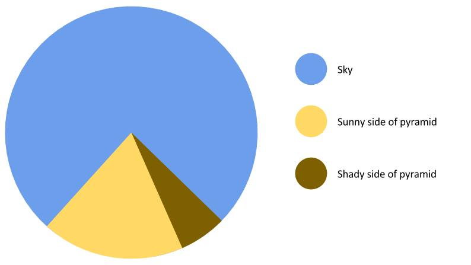
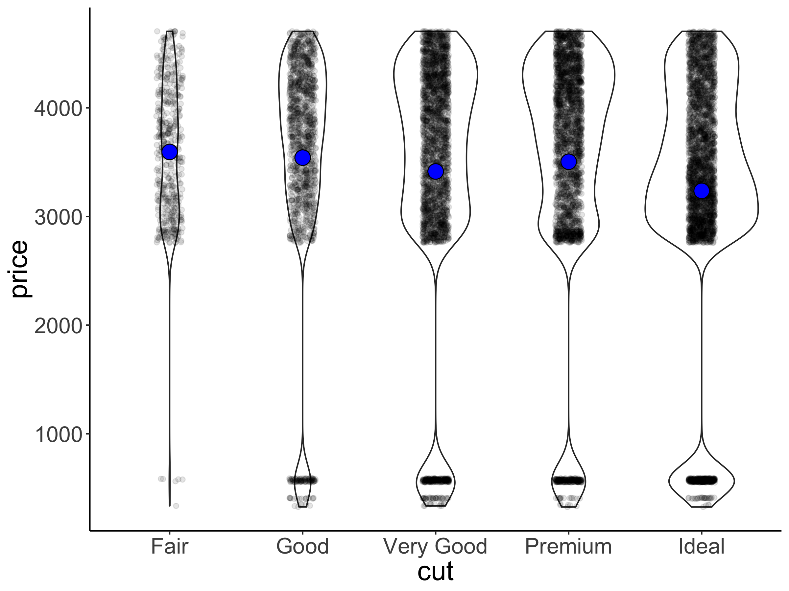
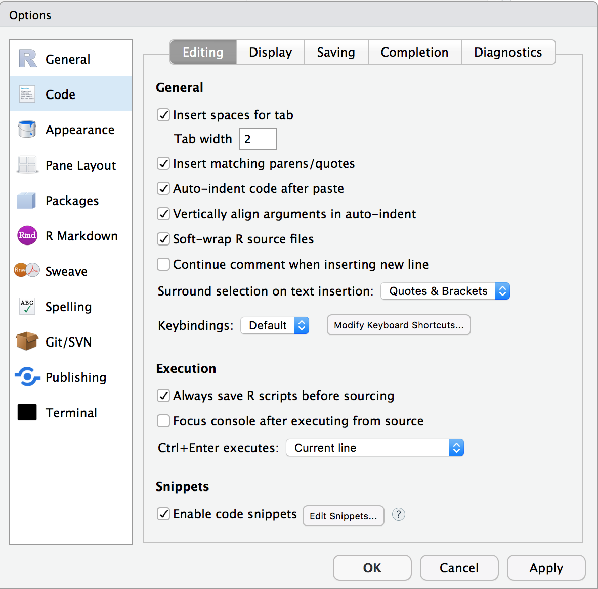

```{r setup, include=FALSE}
# these options here change the formatting of how comments are rendered
knitr::opts_chunk$set(collapse = TRUE,
                      comment = "#>")
```

# Visualization 2

In this lecture, we will lift our `ggplot2` skills to the next level! 

## Learning objectives 

- Deciding what plot is appropriate for what kind of data.  
- Customizing plots: Take a sad plot and make it better. 
- Saving plots. 
- Making figure panels. 
- Debugging. 
- Making animations. 
- Defining snippets. 

## Install and load packages, load data, set theme

Let's first install the new packages that you might not have yet. 

```{r visualization2-01, eval=FALSE}
install.packages(c("ggpol", "gganimate", "gapminder", "ggridges", "devtools", "png", "gifski", "patchwork"))
```

Now, let's load the packages that we need for this chapter. 

```{r visualization2-02, message=FALSE}
library("knitr")     # for rendering the RMarkdown file
library("patchwork") # for making figure panels
library("ggpol")     # for making fancy boxplots
library("ggridges")  # for making joyplots 
library("gganimate") # for making animations
library("gapminder") # data available from Gapminder.org 
library("tidyverse") # for plotting (and many more cool things we'll discover later)
```

And let's load the diamonds data again. 

```{r visualization2-03}
df.diamonds = diamonds
```

Let's also set the default theme for the plots again. 

```{r visualization2-04}
theme_set(theme_classic() + #set the theme 
            theme(text = element_text(size = 20))) #set the default text size
```

## Overview of different plot types for different things 

Different plots work best for different kinds of data. Let's take a look at some. 

### Proportions 

#### Stacked bar charts 

```{r visualization2-05}
ggplot(data = df.diamonds, 
       mapping = aes(x = cut,
                     fill = color)) +
  geom_bar(color = "black")
```

This bar chart shows for the different cuts (x-axis), the number of diamonds of different color. Stacked bar charts give a good general impression of the data. However, it's difficult to precisely compare different proportions. 

#### Pie charts 

```{r visualization2-06, echo=FALSE, fig.align="center", out.width="90%", fig.cap="Finally a pie chart that makes sense."}

```

Pie charts have a bad reputation. And there are indeed a number of problems with pie charts: 

- proportions are difficult to compare 
- don't look good when there are many categories 

```{r visualization2-07}
ggplot(data = df.diamonds,
       mapping = aes(x = 1,
                     fill = cut)) +
  geom_bar() +
  coord_polar("y", start = 0) +
  theme_void()
```

We can create a pie chart with `ggplot2` by changing the coordinate system using `coord_polar()`.

If we are interested in comparing proportions and we don't have too many data points, then tables are a good alternative to showing figures. 

### Comparisons 

Often we want to compare the data from many different conditions. And sometimes, it's also useful to get a sense for what the individual participant data look like. Here is a plot that achieves both. 

```{r visualization2-08, fig.cap='Price of differently colored diamonds. Red circles are means, black circles are individual data poins, and the error bars are 95% bootstrapped confidence intervals.'}
ggplot(data = df.diamonds[1:150, ],
       mapping = aes(x = color, y = price)) +
  # individual data points (jittered horizontally)
  geom_point(alpha = 0.2,
             color = "blue",
             position = position_jitter(width = 0.1, height = 0),
             size = 2) +
  # means with confidence intervals 
  stat_summary(fun.data = "mean_cl_boot",
             geom = "pointrange",
             color = "black",
             fill = "yellow",
             shape = 21,
             size = 1)
```

Note that I'm only plotting the first 150 entries of the data here by setting `data = df.diamonds[1:150,]` in `gpplot()`. 

This plot shows means, bootstrapped confidence intervals, and individual data points. I've used two tricks to make the individual data points easier to see. 
1. I've set the `alpha` attribute to make the points somewhat transparent.
2. I've used the `position_jitter()` function to jitter the points horizontally.
3. I've used `shape = 21` for displaying the mean. For this circle shape, we can set a `color` and `fill` (see Figure \@ref(fig:visualization2-09))

```{r visualization2-09, echo=FALSE, fig.cap="Different shapes that can be used for plotting."}
# plot showing the different shapes 
df.plot = tibble(x = rep(1:5, 5),
                 y = rep(seq(5, 1, -1), each = 5),
                 shape = 1:25) %>% 
  mutate(shape = as.factor(shape))

ggplot(data = df.plot,
       mapping = aes(x = x,
                     y = y,
                     shape = shape)) +
  geom_point(fill = "red",
             size = 5,
             show.legend = F) +
  geom_text(mapping = aes(label = shape),
            vjust = -1.3,
            size = 5) +
  scale_shape_manual(values = 1:25) +
  coord_cartesian(clip = "off") + 
  theme_void()+
  theme(plot.margin = margin(t = 0.2, unit = "inch"))
```

Here is an example of an actual plot that I've made for a paper that I'm working on (using the same techniques). 

```{r visualization2-10, echo=FALSE, fig.align="center", out.width="90%", fig.cap="Participants’ preference for the conjunctive (top) versus dis-junctive (bottom) structure as a function of the explanation (abnormal cause vs. normalcause) and the type of norm (statistical vs. prescriptive). Note: Large circles are groupmeans. Error bars are bootstrapped 95% confidence intervals. Small circles are individualparticipants’ judgments (jittered along the x-axis for visibility)"}
include_graphics("figures/normality_judgments.png")
```


#### Boxplots

Another way to get a sense for the distribution of the data is to use box plots.

```{r visualization2-11}
ggplot(data = df.diamonds[1:500,],
       mapping = aes(x = color, y = price)) +
  geom_boxplot()
```

What do boxplots show? Here adapted from `help(geom_boxplot())`:  

> The boxplots show the median as a horizontal black line. The lower and upper hinges correspond to the first and third quartiles (the 25th and 75th percentiles) of the data. The whiskers (= black vertical lines) extend from the top or bottom of the hinge by at most 1.5 * IQR (where IQR is the inter-quartile range, or distance between the first and third quartiles). Data beyond the end of the whiskers are called "outlying" points and are plotted individually.

Personally, I'm not a big fan of boxplots. Many data sets are consistent with the same boxplot. 

```{r visualization2-12, echo=FALSE, fig.cap="Box plot distributions. Source: https://www.autodeskresearch.com/publications/samestats"}
include_graphics("figures/boxplots.gif")
```

Figure \@ref(fig:visualization2-12) shows three different distributions that each correspond to the same boxplot. 

If there is not too much data, I recommend to plot jittered individual data points instead. If you do have a lot of data points, then violin plots can be helpful. 

```{r visualization2-13, echo=FALSE, fig.cap="Boxplot distributions. Source: https://www.autodeskresearch.com/publications/samestats"}
include_graphics("figures/box_violin.gif")
```

Figure \@ref(fig:visualization2-13) shows the same raw data represented as jittered dots, boxplots, and violin plots.  

The `ggpol` packages has a `geom_boxjitter()` function which displays a boxplot and the jittered data right next to each other. 
```{r visualization2-14}
set.seed(1) # used to make the example reproducible
ggplot(data = df.diamonds %>% sample_n(1000),
       mapping = aes(x = color, y = price)) +
  ggpol::geom_boxjitter(jitter.shape = 1,
                 jitter.color = "black", 
                 jitter.alpha = 0.2,
                 jitter.height = 0, 
                 jitter.width = 0.04,
                 outlier.color = NA, 
                 errorbar.draw = FALSE) +
  # let's also add the means to the plot
  stat_summary(fun.y = "mean",
               geom = "point",
               shape = 21,
               color = "black",
               fill = "yellow",
               size = 4)
```

#### Violin plots

We make violin plots like so: 

```{r visualization2-15}
ggplot(data = df.diamonds,
       mapping = aes(x = color, y = price)) +
  geom_violin()
```

Violin plots are good for detecting bimodal distributions. They work well when: 

1. You have many data points. 
2. The data is continuous.

Violin plots don't work well for Likert-scale data (e.g. ratings on a discrete scale from 1 to 7). Here is a simple example: 

```{r visualization2-16}
set.seed(1)
data = tibble(rating = sample(x = 1:7,
                              prob = c(0.1, 0.4, 0.1, 0.1, 0.2, 0, 0.1),
                              size = 500,
                              replace = T))

ggplot(data = data,
       mapping = aes(x = "Likert", y = rating)) +
  geom_violin() + 
  geom_point(position = position_jitter(width = 0.05,
                                        height = 0.1),
             alpha = 0.05)
```

This represents a vase much better than it represents the data.

#### Joy plots

We can also show the distributions along the x-axis using the `geom_density_ridges()` function from the `ggridges` package. 

```{r visualization2-17}
ggplot(data = df.diamonds,
       mapping = aes(x = price, y = color)) +
  ggridges::geom_density_ridges(scale = 1.5)
```

#### Practice plot 1 

Try to make the plot shown in Figure \@ref(fig:visualization2-19). Here are some tips: 

- For the data argument in `ggplot()` use: `df.diamonds[1:1000, ]` (this selects the first 1000 rows).
- Figure \@ref(fig:visualization2-08) will help you with figuring out the other components

```{r visualization2-18}
# make the plot here 
```

```{r visualization2-19, echo=FALSE, fig.cap='Practice plot 1.'}

```

### Relationships 

#### Scatter plots

Scatter plots are great for looking at the relationship between two continuous variables. 

```{r visualization2-20}
ggplot(data = df.diamonds,
       mapping = aes(x = carat,
                     y = price,
                     color = color)) +
  geom_point()
```

#### Raster plots 

These are useful for looking how a variable of interest varies as a function of two other variables. For example, when we are trying to fit a model with two parameters, we might be interested to see how well the model does for different combinations of these two parameters. Here, we'll plot what `carat` values diamonds of different `color` and `clarity` have. 

```{r visualization2-21}
ggplot(data = df.diamonds,
       mapping = aes(x = color,
                     y = clarity,
                     z = carat)) +
  stat_summary_2d(fun = "mean", geom = "tile")
```

Not too bad. Let's add a few tweaks to make it look nicer. 

```{r visualization2-22}
ggplot(data = df.diamonds,
       mapping = aes(x = color,
                     y = clarity,
                     z = carat)) +
  stat_summary_2d(fun = "mean",
                  geom = "tile",
                  color = "black") +
  scale_fill_gradient(low = "white", high = "black") +
  labs(fill = "carat")
```

I've added some outlines to the tiles by specifying `color = "black"` in `geom_tile()` and I've changed the scale for the fill gradient. I've defined the color for the low value to be "white", and for the high value to be "black." Finally, I've changed the lower and upper limit of the scale via the `limits` argument. Looks much better now! We see that diamonds with clarity `I1` and color `J` tend to have the highest `carat` values on average. 

### Temporal data 

Line plots are a good choice for temporal data. Here, I'll use the `txhousing` data that comes with the `ggplot2` package. The dataset contains information about housing sales in Texas. 

```{r visualization2-23}
# ignore this part for now (we'll learn about data wrangling soon)
df.plot = txhousing %>% 
  filter(city %in% c("Dallas", "Fort Worth", "San Antonio", "Houston")) %>% 
  mutate(city = factor(city, levels = c("Dallas", "Houston", "San Antonio", "Fort Worth")))

ggplot(data = df.plot,
       mapping = aes(x = year,
                     y = median,
                     color = city,
                     fill = city)) +
  stat_summary(fun.data = "mean_cl_boot",
               geom = "ribbon",
               alpha = 0.2,
               linetype = 0) +
  stat_summary(fun.y = "mean", geom = "line") +
  stat_summary(fun.y = "mean", geom = "point") 
```

Ignore the top part where I'm defining `df.plot` for now (we'll look into this in the next class). The other part is fairly straightforward. I've used `stat_summary()` three times: First, to define the confidence interval as a `geom = "ribbon"`. Second, to show the lines connecting the means, and third to put the means as data points points on top of the lines. 

Let's tweak the figure some more to make it look real good. 

```{r visualization2-24}
df.plot = txhousing %>% 
  filter(city %in% c("Dallas", "Fort Worth", "San Antonio", "Houston")) %>% 
  mutate(city = factor(city, levels = c("Dallas", "Houston", "San Antonio", "Fort Worth")))

df.text = df.plot %>% 
  filter(year == max(year)) %>% 
  group_by(city) %>% 
  summarize(year = mean(year) + 0.2, 
            median = mean(median))

ggplot(
  data = df.plot,
  mapping = aes(x = year, 
                y = median,
                color = city,
                fill = city)) +
  # draw dashed horizontal lines in the background
  geom_hline(yintercept = seq(from = 100000,
                              to = 250000,
                              by = 50000),
             linetype = 2,
             alpha = 0.2) + 
  # draw ribbon
  stat_summary(fun.data = mean_cl_boot,
               geom = "ribbon",
               alpha = 0.2,
               linetype = 0) +
  # draw lines connecting the means
  stat_summary(fun.y = "mean", geom = "line") +
  # draw means as points
  stat_summary(fun.y = "mean", geom = "point") +
  # add the city names
  geom_text(data = df.text,
            mapping = aes(label = city),
            hjust = 0,
            size = 5) + 
  # set the y-axis labels
  scale_y_continuous(breaks = seq(from = 100000,
                                  to = 250000,
                                  by = 50000),
                     labels = str_c("$",
                                    seq(from = 100,
                                        to = 250,
                                        by = 50),
                                    "K")) + 
  # set the x-axis labels
  scale_x_continuous(breaks = seq(from = 2000,
                                  to = 2015,
                                  by = 5)) +
  # set the limits for the coordinates
  coord_cartesian(xlim = c(1999, 2015),
                  clip = "off",
                  expand = F) + 
  # set the plot title and axes titles
  labs(title = "Change of median house sale price in Texas",
       x = "Year",
       y = "Median house sale price",
       fill = "",
       color = "") + 
  theme(title = element_text(size = 16),
        legend.position = "none",
        plot.margin = margin(r = 1, unit = "in"))
```

## Customizing plots 

So far, we've seen a number of different ways of plotting data. Now, let's look into how to customize the plots. For example, we may wanta to change the axis labels, add a title, increase the font size. `ggplot2` let's you customize almost anything. 

Let's start simple. 

```{r visualization2-25}
ggplot(data = df.diamonds,
       mapping = aes(x = cut, y = price)) +
  stat_summary(fun.y = "mean",
               geom = "bar",
               color = "black") +
  stat_summary(fun.data = "mean_cl_boot",
               geom = "linerange")
```

This plot shows the average price for diamonds with a different quality of the cut, as well as the bootstrapped confidence intervals. Here are some things we can do to make it look nicer. 

```{r visualization2-26}
ggplot(data = df.diamonds, mapping = aes(x = cut, y = price)) +
  # change color of the fill, make a little more space between bars by setting their width
  stat_summary(fun.y = "mean",
               geom = "bar",
               color = "black",
               fill = "lightblue",
               width = 0.85) + 
  # make error bars thicker
  stat_summary(fun.data = "mean_cl_boot",
               geom = "linerange",
               size = 1.5) + 
  # add a title, subtitle, and changed axis labels 
  labs(title = "Price as a function of quality of cut", 
    subtitle = "Note: The price is in US dollars",
    tag = "A",
    x = "Quality of the cut", 
    y = "Price") + 
  # adjust what to show on the y-axis
  scale_y_continuous(breaks = seq(from = 0, to = 4000, by = 2000),
                     labels = seq(from = 0, to = 4000, by = 2000)) + 
  # adjust the range of both axes
  coord_cartesian(xlim = c(0.25, 5.75),
                  ylim = c(0, 5000),
                  expand = F) + 
  theme(
    # adjust the text size 
    text = element_text(size = 20), 
    # add some space at top of x-title 
    axis.title.x = element_text(margin = margin(t = 0.2, unit = "inch")), 
    # add some space t the right of y-title
    axis.title.y = element_text(margin = margin(r = 0.1, unit = "inch")), 
    # add some space underneath the subtitle and make it gray
    plot.subtitle = element_text(margin = margin(b = 0.3, unit = "inch"),
                                 color = "gray70"),  
    # make the plot tag bold 
    plot.tag = element_text(face = "bold"), 
    # move the plot tag a little
    plot.tag.position = c(0.05, 0.99) 
  )
```

I've tweaked quite a few things here (and I've added comments to explain what's happening). Take a quick look at the `theme()` function to see all the things you can change. 

### Changing the order of things

Sometimes we don't have a natural ordering of our independent variable. In that case, it's nice to show the data in order. 

```{r visualization2-27}
ggplot(data = df.diamonds,
       mapping = aes(x = reorder(cut, price), y = price)) +
  stat_summary(fun.y = "mean",
               geom = "bar",
               color = "black",
               fill = "lightblue",
               width = 0.85) +
  stat_summary(fun.data = "mean_cl_boot",
               geom = "linerange",
               size = 1.5) +
  labs(x = "cut")
```

The `reorder()` function helps us to do just that. Now, the results are ordered according to price. To show the results in descending order, I would simply need to write `reorder(cut, -price)` instead.

### Dealing with legends 

Legends form an important part of many figures. However, it is often better to avoid legends if possible, and directly label the data. This way, the reader doesn't have to look back and forth between the plot and the legend to understand what's going on. 

Here, we'll look into a few aspects that come up quite often. There are two main functions to manipulate legends with ggplot2 
1. `theme()` (there are a number of arguments starting with `legend.`)
2. `guide_legend()`

Let's make a plot with a legend. 

```{r visualization2-28}
ggplot(data = df.diamonds,
       mapping = aes(x = color,
                     y = price,
                     color = clarity)) +
  stat_summary(fun.y = "mean", geom = "point")
```

Let's move the legend to the bottom of the plot: 

```{r visualization2-29}
ggplot(data = df.diamonds,
       mapping = aes(x = color,
                     y = price,
                     color = clarity)) +
  stat_summary(fun.y = "mean", geom = "point") +
  theme(legend.position = "bottom")
```

Let's change a few more things in the legend using the `guides()` function: 

- have 3 rows 
- reverse the legend order 
- make the points in the legend larger 

```{r visualization2-30}
ggplot(data = df.diamonds, mapping = aes(x = color, y = price, color = clarity)) +
  stat_summary(fun.y = "mean", geom = "point", size = 2) +
  theme(legend.position = "bottom") +
  guides(color = guide_legend(nrow = 3, # 3 rows 
                              reverse = TRUE, # reversed order 
                              override.aes = list(size = 6))) # point size 
```

### Choosing good colors

[Color brewer](http://colorbrewer2.org/) helps with finding colors that are colorblind safe and printfriendly. For more information on how to use color effectively see [here](http://socviz.co/refineplots.html#refineplots). 

### Customizing themes 

For a given project, I often want all of my plots to share certain visual features such as the font type, font size, how the axes are displayed, etc. Instead of defining these for each individual plot, I can set a theme at the beginning of my project so that it applies to all the plots in this file. To do so, I use the `theme_set()` command: 

```{r visualization2-31, eval=FALSE}
theme_set(theme_classic() + #classic theme
            theme(text = element_text(size = 20))) #text size 
```

Here, I've just defined that I want to use `theme_classic()` for all my plots, and that the text size should be 20. For any individual plot, I can still overwrite any of these defaults. 

## Saving plots 

To save plots, use the `ggsave()` command. Personally, I prefer to save my plots as pdf files. This way, the plot looks good no matter what size you need it to be. This means it'll look good both in presentations as well as in a paper. You can save the plot in any format that you like. 

I strongly recommend to use a relative path to specify where the figure should be saved. This way, if you are sharing the project with someone else via Stanford Box, Dropbox, or Github, they will be able to run the code without errors. 

Here is an example for how to save one of the plots that we've created above. 

```{r visualization2-32, results = "hold"}
p1 = ggplot(data = df.diamonds,
            mapping = aes(x = cut, y = price)) +
  stat_summary(fun.y = "mean",
               geom = "bar",
               color = "black",
               fill = "lightblue") +
  stat_summary(fun.data = "mean_cl_boot",
               geom = "linerange",
               size = 1)
print(p1)

p2 = ggplot(data = df.diamonds,
            mapping = aes(x = cut, y = price)) +
  stat_summary(fun.y = "mean",
               geom = "bar",
               color = "black",
               fill = "lightblue") +
  stat_summary(fun.data = "mean_cl_boot",
               geom = "linerange",
               size = 1)

ggsave(filename = "figures/diamond_plot.pdf",
       plot = p1,
       width = 8,
       height = 6)
```

Here, I'm saving the plot in the `figures` folder and it's name is `diamond_plot.pdf`. I also specify the width and height as the plot in inches (which is the default unit). 

## Creating figure panels 

Sometimes, we want to create a figure with several subfigures, each of which is labeled with a), b), etc. We have already learned how to make separate panels using `facet_wrap()` or `facet_grid()`. The R package `patchwork` makes it very easy to combine multiple plots. 

Let's combine a few plots that we've made above into one. 

```{r visualization2-33}
# first plot
p1 = ggplot(data = df.diamonds,
            mapping = aes(x = y, fill = color)) +
  geom_density(bw = 0.2,
               show.legend = F) +
  facet_grid(cols = vars(color)) +
  coord_cartesian(xlim = c(3, 10),
                  expand = F) + #setting expand to FALSE removes any padding on x and y axes
  labs(title = "Width of differently colored diamonds",
       tag = "A")

# second plot
p2 = ggplot(data = df.diamonds,
            mapping = aes(x = color,
                          y = clarity,
                          z = carat)) +
  stat_summary_2d(fun = "mean",
                  geom = "tile") +
  labs(title = "Carat values",
       subtitle = "For different color and clarity",
       x = "Color",
       tag = "B")

# third plot
p3 = ggplot(data = df.diamonds,
            mapping = aes(x = cut, y = price)) +
  stat_summary(fun.y = "mean",
               geom = "bar",
               color = "black",
               fill = "lightblue",
               width = 0.85) +
  stat_summary(fun.data = "mean_cl_boot",
               geom = "linerange",
               size = 1.5) + 
  scale_x_discrete(labels = c("fair", "good", "very\ngood", "premium", "ideal")) +
  labs(title = "Price as a function of cut", 
       subtitle = "Note: The price is in US dollars",
       tag = "C",
       x = "Quality of the cut", 
       y = "Price") + 
  coord_cartesian(xlim = c(0.25, 5.75),
                  ylim = c(0, 5000),
                  expand = F)

# combine the plots
p1 + (p2 + p3) + 
  plot_layout(ncol = 1) & 
  theme_classic() & 
  theme(plot.tag = element_text(face = "bold", size = 20))

# ggsave("figures/combined_plot.png", width = 10, height = 6)
```

Not a perfect plot yet, but you get the idea. To combine the plots, we defined that we would like p2 and p3 to be displayed in the same row using the `()` syntax. And we specified that we only want one column via the `plot_layout()` function. We also applied the same `theme_classic()` to all the plots using the `&` operator, and formatted how the plot tags should be displayed. For more info on how to use `patchwork`, take a look at the [readme](https://github.com/thomasp85/patchwork) on the github page. 

Other packages that provide additional functionality for combining multiple plots into one are 

- [`gridExtra`](https://cran.r-project.org/web/packages/gridExtra/index.html) and 
- [`cowplot`](https://cran.r-project.org/web/packages/cowplot/index.html). You can find more information on how to lay out multiple plots [here](https://cran.r-project.org/web/packages/egg/vignettes/Ecosystem.html).

An alternative way for making these plots is to use Adobe Illustrator, Powerpoint, or Keynote. However, you want to make changing plots as easy as possible. Adobe Illustrator has a feature that allows you to link to files. This way, if you change the plot, the plot within the illustrator file gets updated automatically as well. 

If possible, it's __much__ better to do everything in R though so that your plot can easily be reproduced by someone else. 

## Peeking behind the scenes 

Sometimes it can be helpful for debugging to take a look behind the scenes. Silently, `ggplot()` computes a data frame based on the information you pass to it. We can take a look at the data frame that's underlying the plot. 

```{r visualization2-34}
p = ggplot(data = df.diamonds,
           mapping = aes(x = color,
                         y = clarity,
                         z = carat)) +
  stat_summary_2d(fun = "mean",
                  geom = "tile",
                  color = "black") +
  scale_fill_gradient(low = "white", high = "black")
print(p)

build = ggplot_build(p)
df.plot_info = build$data[[1]]
dim(df.plot_info) # data frame dimensions
```

I've called the `ggplot_build()` function on the ggplot2 object that we saved as `p`. I've then printed out the data associated with that plot object. The first thing we note about the data frame is how many entries it has, `r nrow(df.plot_info)`. That's good. This means there is one value for each of the 7 x 8 grids. The columns tell us what color was used for the `fill`, the `value` associated with each row, where each row is being displayed (`x` and `y`), etc.   

If a plot looks weird, it's worth taking a look behind the scenes. For example, something we thing we could have tried is the following (in fact, this is what I tried first): 

```{r visualization2-35}
p = ggplot(data = df.diamonds,
           mapping = aes(x = color,
                         y = clarity,
                         fill = carat)) +
  geom_tile(color = "black") +
  scale_fill_gradient(low = "white", high = "black")
print(p)

build = ggplot_build(p)
df.plot_info = build$data[[1]]
dim(df.plot_info) # data frame dimensions
```

Why does this plot look different from the one before? What went wrong here? Notice that the data frame associated with the ggplot2 object has `r nrow(df.plot_info)` rows. So instead of plotting means here, we plotted all the individual data points. So what we are seeing here is just the top layer of many, many layers. 

## Making animations 

Animated plots can be a great way to illustrate your data in presentations. The R package `gganimate` lets you do just that. 

Here is an example showing how to use it. 

```{r visualization2-36, interval=1/60, results='hold', cache=TRUE}
ggplot(data = gapminder,
       mapping = aes(x = gdpPercap,
                     y = lifeExp,
                     size = pop,
                     colour = country)) +
  geom_point(alpha = 0.7, show.legend = FALSE) +
  geom_text(data = gapminder %>% filter(country %in% c("United States", "China", "India")), 
            mapping = aes(label = country),
            color = "black",
            vjust = -0.75,
            show.legend = FALSE) +
  scale_colour_manual(values = country_colors) +
  scale_size(range = c(2, 12)) +
  scale_x_log10(breaks = c(1e3, 1e4, 1e5),
                labels = c("1,000", "10,000", "100,000")) +
  theme_classic() +
  theme(text = element_text(size = 23)) +
  # Here come the gganimate specific bits
  labs(title = "Year: {frame_time}", x = "GDP per capita", y = "life expectancy") +
  transition_time(year) +
  ease_aes("linear")
# anim_save(filename = "figures/life_gdp_animation.gif") # to save the animation
```

This takes a while to run but it's worth the wait. The plot shows the relationship between GDP per capita (on the x-axis) and life expectancy (on the y-axis) changes across different years for the countries of different continents. The size of each dot represents the population size of the respective country. And different countries are shown in different colors. This animation is not super useful yet in that we don't know which continents and countries the different dots represent. I've added a label to the United States, China, and India. 

Note how little is required to define the `gganimate`-specific information! The `{frame_time}` variable changes the title for each frame. The `transition_time()` variable is set to `year`, and the kind of transition is set as 'linear' in `ease_aes()`. I've saved the animation as a gif in the figures folder. 
We won't have time to go into more detail here but I encourage you to play around with `gganimate`. It's fun, looks cool, and (if done well) makes for a great slide in your next presentation! 

## Shiny apps 

The package [`shiny`](https://shiny.rstudio.com/) makes it relatively easy to create interactive plots that can be hosted online. Here is a [gallery](https://shiny.rstudio.com/gallery/) with some examples. 

## Defining snippets 

Often, we want to create similar plots over and over again. One way to achieve this is by finding the original plot, copy and pasting it, and changing the bits that need changing. Another more flexible and faster way to do this is by using snippets. Snippets are short pieces of code that 

Here are some snippets I use: 

```{r visualization2-37, eval=FALSE}
snippet snbar
	ggplot(data = ${1:data}, mapping = aes(x = ${2:x}, y = ${3:y})) +
		stat_summary(fun.y = "mean", geom = "bar", color = "black") +
		stat_summary(fun.data = "mean_cl_boot", geom = "linerange")
		
snippet sngg
	ggplot(data = ${1:data}, mapping = aes(${2:aes})) +
		${0}

snippet sndf
	${1:data} = ${1:data} %>% 
		${0}
```

To make a bar plot, I now only need to type `snbar` and then hit TAB to activate the snippet. I can then cycle through the bits in the code that are marked with `${Number:word}` by hitting TAB again. 

In RStudio, you can change and add snippets by going to Tools --> Global Options... --> Code --> Edit Snippets. Make sure to set the tick mark in front of Enable Code Snippets (see Figure \@ref(fig:visualization2-38)). 
). 

```{r visualization2-38, echo=FALSE, fig.cap="Enable code snippets."}

```

To edit code snippets faster, run this command from the `usethis` package. Make sure to install the package first if you don't have it yet. 

```{r visualization2-39, eval=FALSE}
# install.packages("usethis")
usethis::edit_rstudio_snippets()
```

This command opens up a separate tab in RStudio called `r.snippets` so that you can make new snippets and adapt old ones more quickly. Take a look at the snippets that RStudio already comes with. And then, make some new ones! By using snippets you will be able to avoid typing the same code over and over again, and you won't have to memorize as much, too. 

## Additional resources 

### Cheatsheets 

- [shiny](figures/shiny.pdf) --> interactive plots 

### Data camp courses 

- [ggplot2 course 3](https://www.datacamp.com/courses/data-visualization-with-ggplot2-3)
- [shiny 1](https://www.datacamp.com/courses/building-web-applications-in-r-with-shiny)
- [shiny 2](https://www.datacamp.com/courses/building-web-applications-in-r-with-shiny-case-studies)

### Books and chapters

- [R for Data Science book](http://r4ds.had.co.nz/)
	+ [Data visualization](http://r4ds.had.co.nz/data-visualisation.html)
	+ [Graphics for communication](http://r4ds.had.co.nz/graphics-for-communication.html)
- [Data Visualization -- A practical introduction (by Kieran Healy)](http://socviz.co/)
  + [Refine your plots](http://socviz.co/refineplots.html#refineplots)

### Misc

- [ggplot2 extensions](http://www.ggplot2-exts.org/gallery/) --> gallery of ggplot2 extension packages 
- [ggplot2 gui](https://github.com/dreamRs/esquisse) --> ggplot2 extension package 
- [ggplot2 visualizations with code](http://r-statistics.co/Top50-Ggplot2-Visualizations-MasterList-R-Code.html) --> gallery of plots with code
- [Color brewer](http://colorbrewer2.org/) --> for finding colors 
- [shiny apps examples](https://sites.psu.edu/shinyapps/) --> shiny apps examples that focus on statistics teaching (made by students at PennState) 

## Session info 

Information about this R session including which version of R was used, and what packages were loaded. 

```{r visualization2-40}
sessionInfo()
```
