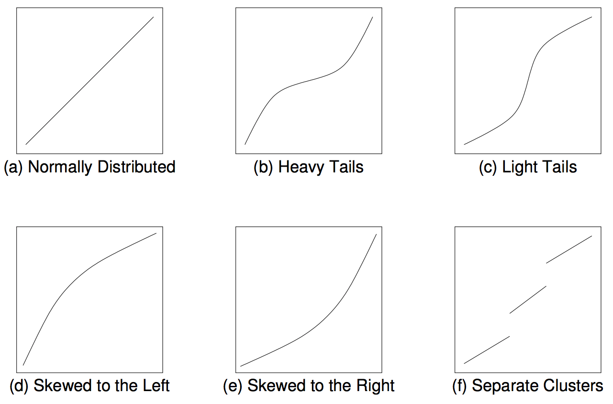

```{r setup, include=FALSE}
# these options here change the formatting of how comments are rendered
knitr::opts_chunk$set(comment = "")
```

# Simulation 1 

## Load packages and set plotting theme  

```{r install-packages, include=FALSE, eval=FALSE}
# run this code chunk once to make sure you have all the packages
install.packages(c("kableExtra", "MASS"))
```

```{r load-packages, message=FALSE}
library("knitr")
library("kableExtra")
library("MASS")
library("patchwork")
library("tidyverse")
```

```{r set-theme}
theme_set(
  theme_classic() + #set the theme 
    theme(text = element_text(size = 20)) #set the default text size
)
```

## Working with distributions 

Every distribution that R handles has four functions. There is a root name, for example, the root name for the normal distribution is `norm`. This root is prefixed by one of the letters here:

```{r distributions, echo=F}
tibble(
  letter = c("`d`","`p`","`q`","`r`"),
  description = c('for "__density__", the density function (probability function (for _discrete_ variables) or probability density function (for _continuous_ variables))',
                  'for "__probability__", the cumulative distribution function',
                  'for "__quantile__", the inverse cumulative distribution function',
                  'for "__random__", a random variable having the specified distribution'),
  example = c("`dnorm()`", "`pnorm()`", "`qnorm()`", "`rnorm()`")
)%>% 
kable() %>% 
kable_styling(bootstrap_options = "striped",
              full_width = F)
```


For the normal distribution, these functions are `dnorm`, `pnorm`, `qnorm`, and `rnorm`. For the binomial distribution, these functions are `dbinom`, `pbinom`, `qbinom`, and `rbinom`. And so forth.

You can get more info about the distributions that come with R via running `help(Distributions)` in your console. If you need a distribution that doesn't already come with R, then take a look [here](https://cran.r-project.org/web/views/Distributions.html) for many more distributions that can be loaded with different R packages. 

### Plotting distributions 

Here's an easy way to plot distributions in `ggplot2` using the `stat_function()` function. 

```{r plotting-normal, results = "hold"}
ggplot(data = tibble(x = c(-5, 5)),
       mapping = aes(x = x)) +
  stat_function(fun = "dnorm")
```

Note that the data frame I created with `tibble()` only needs to have the minimum and the maximum value of the x-range that we are interested in. Here, I chose `-5` and `5` as the minimum and maximum, respectively. 

The `stat_function()` is very flexible. We can define our own functions and plot these like here: 

```{r plotting-function, results='hold'}
# define the breakpoint function 
fun.breakpoint = function(x, breakpoint){
  x[x < breakpoint] = breakpoint
  return(x)
}

# plot the function
ggplot(data = tibble(x = c(-5, 5)),
       mapping = aes(x = x)) +
  stat_function(fun = "fun.breakpoint",
                args = list(breakpoint = 2)
                )
```

Here, I defined a breakpoint function. If the value of `x` is below the breakpoint, `y` equals the value of the breakpoint. If the value of `x` is greater than the breakpoint, then `y` equals `x`. 

Note how I used the `args = ` argument in the `stat_function()` to supply the breakpoint parameter that my `fun.breakpoint()` wants. Make sure to put these parameters into a `list()` as shown above. 

Let's play around with the parameters of the normal distribution. The normal distribution takes two parameters, the mean and standard deviation. Again, I'm going to use the `args = ` argument to supply these parameters.  

```{r plotting-normal2}
tmp.mean = 0
tmp.sd = 2

ggplot(data = tibble(x = c(140, 220)),
       mapping = aes(x = x)) +
  stat_function(fun = "dnorm",
                args = list(mean = tmp.mean,
                            sd = tmp.sd))

# remove all variables with tmp in their name 
rm(list = ls() %>% str_subset(pattern = "tmp."))
```

To keep my environment clean, I've named the parameters `tmp.mean` and `tmp.sd` and then, at the end of the code chunk, I removed all variables from the environment that have "tmp." in their name using the `ls()` function (which prints out all variables in the environment as a vector), and the `str_subset()` function which filters out only those variables that contain the specified pattern.

### Sampling from distributions 

For each distribution, R provides a way of sampling random number from this distribution. For the normal distribution, we can use the `rnorm()` function to take random samples. 

So let's take some random samples and plot a histogram. 

```{r sampling-distributions1}
# make this example reproducible 
set.seed(1)

# define how many samples to draw 
tmp.nsamples = 100

# make a data frame with the samples
df.plot = tibble(
  x = rnorm(n = tmp.nsamples, mean = 0, sd = 1)
) 

# plot the samples using a histogram 
ggplot(data = df.plot,
       mapping = aes(x = x)) +
  geom_histogram(binwidth = 0.2,
                 color = "black",
                 fill = "lightblue") +
  scale_x_continuous(breaks = -4:4, labels = -4:4) +
  coord_cartesian(xlim = c(-4, 4), expand = T)

# remove all variables with tmp in their name 
rm(list = ls() %>% str_subset(pattern = "tmp."))
```

Let's see how many samples it takes to closely approximate the shape of the normal distribution with our histogram of samples. 

```{r sampling-distributions2}
# make this example reproducible 
set.seed(1)

# play around with this value
tmp.nsamples = 100
# tmp.nsamples = 10000
tmp.binwidth = 0.2

# make a data frame with the samples
df.plot = tibble(
  x = rnorm(n = tmp.nsamples, mean = 0, sd = 1)
) 

# adjust the density of the normal distribution based on the samples and binwidth 
fun.dnorm = function(x, mean, sd, n, binwidth){
  dnorm(x = x, mean = mean, sd = sd) * n * binwidth
}

# plot the samples using a histogram 
ggplot(data = df.plot,
       mapping = aes(x = x)) +
  geom_histogram(binwidth = tmp.binwidth,
                 color = "black",
                 fill = "lightblue") +
  stat_function(fun = "fun.dnorm",
                args = list(mean = 0,
                            sd = 1,
                            n = tmp.nsamples,
                            binwidth = tmp.binwidth),
                xlim = c(min(df.plot$x), max(df.plot$x)),
                size = 2) +
  annotate(geom = "text",
           label = str_c("n = ", tmp.nsamples),
           x = -3.9,
           y = Inf,
           hjust = 0,
           vjust = 1.1,
           size = 10,
           family = "Courier New") +
  scale_x_continuous(breaks = -4:4, labels = -4:4) +
  coord_cartesian(xlim = c(-4, 4), expand = F)

# remove all variables with tmp in their name 
rm(list = ls() %>% str_subset(pattern = "tmp."))
```

With 10,000 samples, our histogram of samples already closely resembles the theoretical shape of the normal distribution. 

### Cumulative probability distribution

```{r cumulative1}

ggplot(data = tibble(x = c(-5, 5)),
       mapping = aes(x = x)) +
  stat_function(fun = "pnorm",
                args = list(mean = 0,
                            sd = 1))
```

Let's find the cumulative probability of a particular value. 

```{r cumulative2}
tmp.x = 1
tmp.y = pnorm(tmp.x, mean = 0, sd = 1)

print(tmp.y %>% round(3))

# draw the cumulative probability distribution and show the value
ggplot(data = tibble(x = c(-5, 5)),
       mapping = aes(x = x)) +
  stat_function(fun = "pnorm",
                args = list(mean = 0,
                            sd = 1)) +
  annotate(geom = "point",
           x = tmp.x, 
           y = tmp.y,
           size = 4,
           color = "blue") +
  geom_segment(mapping = aes(x = tmp.x,
                             xend = tmp.x,
                             y = 0,
                             yend = tmp.y),
               size = 1,
               color = "blue") +
  geom_segment(mapping = aes(x = -5,
                             xend = tmp.x,
                             y = tmp.y,
                             yend = tmp.y),
               size = 1,
               color = "blue") +
  scale_x_continuous(breaks = -5:5) + 
  coord_cartesian(xlim = c(-5, 5),
                  ylim = c(0, 1.05),
                  expand = F)

# remove all variables with tmp in their name 
rm(list = str_subset(string = ls(), pattern = "tmp."))
```

Let's illustrate what this would look like using a normal density plot. 

```{r cumulative3}
ggplot(data = tibble(x = c(-5, 5)),
       mapping = aes(x = x)) + 
  stat_function(fun = "dnorm",
                geom = "area",
                fill = "lightblue",
                xlim = c(-5, 1),
                color = "black",
                linetype = 2) +
  stat_function(fun = "dnorm",
                size = 1.5) +
  coord_cartesian(xlim = c(-5, 5)) +
  scale_x_continuous(breaks = -5:5) +
  scale_y_continuous(expand = expand_scale(mult = c(0, 0.1))) 
```

### Inverse cumulative distribution 

```{r}
ggplot(data = tibble(x = c(0, 1)),
       mapping = aes(x = x)) +
  stat_function(fun = "qnorm",
                args = list(mean = 0,
                            sd = 1))
```

And let's compute the inverse cumulative probability for a particular value. 

```{r}
tmp.x = 0.841
tmp.y = qnorm(tmp.x, mean = 0, sd = 1)

print(tmp.y %>% round(3))

# draw the cumulative probability distribution and show the value
ggplot(data = tibble(x = c(0, 1)),
       mapping = aes(x = x)) +
  stat_function(fun = "qnorm",
                args = list(mean = 0,
                            sd = 1)) +
  annotate(geom = "point",
           x = tmp.x, 
           y = tmp.y,
           size = 4,
           color = "blue") +
  geom_segment(mapping = aes(x = tmp.x,
                             xend = tmp.x,
                             y = -3,
                             yend = tmp.y),
               size = 1,
               color = "blue") +
  geom_segment(mapping = aes(x = 0,
                             xend = tmp.x,
                             y = tmp.y,
                             yend = tmp.y),
               size = 1,
               color = "blue") +
  scale_x_continuous(breaks = seq(from = 0, to = 1, by = 0.1)) + 
  coord_cartesian(xlim = c(0, 1.05),
                  ylim = c(-3, 3),
                  expand = F)

# remove all variables with tmp in their name 
rm(list = str_subset(string = ls(), pattern = "tmp."))
```

### Computing probabilities 

#### Via probability distributions

Let's compute the probability of observing a particular value $x$ in a given range. 

```{r}
# tmp.lower = -1
# tmp.upper = 1

# tmp.lower = -2
# tmp.upper = 2

# tmp.lower = qnorm(0.001)
# tmp.upper = qnorm(0.95)

# tmp.lower = qnorm(0.05)
# tmp.upper = qnorm(0.999)

tmp.lower = qnorm(0.025)
tmp.upper = qnorm(0.975)

tmp.prob = pnorm(tmp.upper) - pnorm(tmp.lower)

ggplot(data = tibble(x = c(-5, 5)),
       mapping = aes(x = x)) + 
  stat_function(fun = "dnorm",
                geom = "area",
                fill = "lightblue",
                xlim = c(tmp.lower, tmp.upper),
                color = "black",
                linetype = 2) +
  stat_function(fun = "dnorm",
                size = 1.5) +
  annotate(geom = "text",
           label = str_c(tmp.prob %>% round(2) * 100, "%"),
           x = 0,
           y = 0.2,
           hjust = 0.5,
           size = 10
           ) +
  coord_cartesian(xlim = c(-5, 5)) +
  scale_x_continuous(breaks = -5:5) +
  scale_y_continuous(expand = expand_scale(mult = c(0, 0.1))) 

# remove all variables with tmp in their name 
rm(list = str_subset(string = ls(), pattern = "tmp."))
```

We find that 95% of the density in the normal distribution is between -1.96 and 1.96. 

#### Via sampling 

We can also compute the probability of observing certain events using sampling. We first generate samples from the desired probability distribution, and then use these samples to compute our statistic of interest. 

```{r sampling1}
# let's compute the probability of observing a value within a certain range 
tmp.lower = -1.96
tmp.upper = 1.96

# make example reproducible
set.seed(1)

# generate some samples and store them in a data frame 
tmp.nsamples = 10000

df.samples = tibble(
  sample = 1:tmp.nsamples,
  value = rnorm(n = tmp.nsamples, mean = 0, sd = 1)
)

# compute the probability that s sample lies within the range of interest
tmp.prob = df.samples %>% 
  filter(value >= tmp.lower,
         value <= tmp.upper) %>% 
  summarize(prob = n()/tmp.nsamples)

# illustrate the result using a histogram 
ggplot(data = df.samples,
       mapping = aes(x = value)) + 
  geom_histogram(binwidth = 0.1,
                 color = "black",
                 fill = "lightblue") +
  scale_x_continuous(breaks = -4:4, labels = -4:4) +
  coord_cartesian(xlim = c(-4, 4), expand = F) +
  geom_vline(xintercept = tmp.lower,
             size = 1, 
             color = "red",
             linetype = 2) +
  geom_vline(xintercept = tmp.upper,
             size = 1, 
             color = "red",
             linetype = 2) +
  annotate(geom = "label",
           label = str_c(tmp.prob %>% round(3) * 100, "%"),
           x = 0,
           y = 200,
           hjust = 0.5,
           size = 10)

# remove all variables with tmp in their name 
rm(list = str_subset(string = ls(), pattern = "tmp."))
```

## Bayesian inference with the normal distribution

Let's consider the following scenario. You are helping out at a summer camp. This summer, two different groups of kids go to the same summer camp. The chess kids, and the basketball kids. The chess summer camp is not quite as popular as the basketball summer camp (shocking, I know!). In fact, twice as many children have signed up for the basketball camp. 

When signing up for the camp, the children were asked for some demographic information including their height in cm. Unsurprisingly, the basketball players tend to be taller on average than the chess players. In fact, the basketball players' height is approximately normally distributed with a mean of 180cm and a standard deviation of 10cm. For the chess players, the mean height is 170cm with a standard deviation of 8cm. 

At the camp site, a child walks over to you and asks you where their gym is. You gage that the child is around 175cm tall. Where should you direct the child to? To the basketball gym, or to the chess gym? 

```{r bayesian1}
height = 175

# priors 
prior_basketball = 2/3 
prior_chess = 1/3 

# likelihood  
mean_basketball = 180
sd_basketball = 10

mean_chess = 170
sd_chess = 8

likelihood_basketball = dnorm(height, mean = mean_basketball, sd = sd_basketball)
likelihood_chess = dnorm(height, mean = mean_chess, sd = sd_chess)

# posterior
posterior_basketball = (likelihood_basketball * prior_basketball) / 
  ((likelihood_basketball * prior_basketball) + (likelihood_chess * prior_chess))

posterior_basketball %>% print()
```

Let's do the same thing via sampling. 

```{r bayesian2}
# number of kids 
tmp.nkids = 10000

# make reproducible 
set.seed(1)

# priors 
prior_basketball = 2/3 
prior_chess = 1/3 

# likelihood functions 
mean_basketball = 180
sd_basketball = 10

mean_chess = 170
sd_chess = 8

# data frame with the kids
df.camp = tibble(
  kid = 1:tmp.nkids,
  sport = sample(c("chess", "basketball"),
                 size = tmp.nkids,
                 replace = T,
                 prob = c(prior_chess, prior_basketball))) %>% 
  rowwise() %>% 
  mutate(height = ifelse(test = sport == "chess",
                         yes = rnorm(., mean = mean_chess, sd = sd_chess),
                         no = rnorm(., mean = mean_basketball, sd = sd_basketball))) %>% 
  ungroup

df.camp %>% print()
```

Now we have a data frame with kids whose height was randomly sampled depending on which sport they do. I've used the `sample()` function to assign a sport to each kid first using the `prob = ` argument to make sure that a kid is more likely to be assigned the sport "basketball" than "chess". 

Note that the solution above is not particularly efficient since it uses the `rowwise()` function to make sure that a different random value for height is drawn for each row. Running this code will get slow for large samples. A more efficient solution would be the following: 

```{r bayesian3}
# number of kids 
tmp.nkids = 100000

# make reproducible 
set.seed(3)

df.camp2 = tibble(
  kid = 1:tmp.nkids,
  sport = sample(c("chess", "basketball"),
                 size = tmp.nkids,
                 replace = T,
                 prob = c(prior_chess, prior_basketball))) %>% 
  arrange(sport) %>% 
  mutate(height = c(rnorm(sum(sport == "basketball"), mean = mean_basketball, sd = sd_basketball),
                    rnorm(sum(sport == "chess"), mean = mean_chess, sd = sd_chess))
         )
```

In this solution, I take advantage of the fact that `rnorm()` is vectorized. That is, it can produce many random draws in one call. To make this work, I first arrange the data frame, and then draw the correct number of samples from each of the two distributions. This works fast, even if I'm drawing a large number of samples. 

How can we now use these samples to answer our question of interest? Let's see what doesn't work first: 

```{r bayesian4, eval=F}
tmp.height = 175

df.camp %>% 
  filter(height == tmp.height) %>% 
  count(sport) %>% 
  spread(sport, n) %>% 
  summarize(prob_basketball = basketball/(basketball + chess))
```

The reason this doesn't work is because none of our kids is exactly 175cm tall. Instead, we need to filter kids that are within a certain height range. 

```{r bayesian5}
tmp.height = 175
tmp.margin = 1

df.camp %>% 
  filter(between(height,
          left = tmp.height - tmp.margin,
          right = tmp.height + tmp.margin)) %>% 
  count(sport) %>% 
  spread(sport, n) %>% 
  summarize(prob_basketball = basketball/(basketball + chess))
```

Here, I've used the `between()` function which is a shortcut for otherwise writing `x >= left & x <= right`. You can play around with the margin to see how the result changes. 

## Working with samples

### Understanding `density()`

First, let's calculate the density for a set of observations and store them in a data frame.

```{r density1, fig.cap='Density estimation.'}

# calculate density
observations = c(1, 1.2, 1.5, 2, 3)
bandwidth = 0.25 # bandwidth (= sd) of the Gaussian distribution 
tmp.density = density(observations,
        kernel = "gaussian",
        bw = bandwidth,
        n = 512)

# save density as data frame 
df.density = tibble(
  x = tmp.density$x,
  y = tmp.density$y
) 

df.density %>% 
  head() %>% 
  kable(digits = 3) %>% 
  kable_styling(bootstrap_options = "striped",
                full_width = F)
```

Now, let's plot the density. 

```{r density2, results='hold'}
ggplot(data = df.density, aes(x = x, y = y)) +
  geom_line(size = 2) +
  geom_point(data = as.tibble(observations),
             mapping = aes(x = value, y = 0),
             size = 3)
```

This density shows the sum of the densities of normal distributions that are centered at the observations with the specified bandwidth. 

```{r density3}

# add densities for the individual normal distributions
for (i in 1:length(observations)){
  df.density[[str_c("observation_",i)]] = dnorm(df.density$x, mean = observations[i], sd = bandwidth)
}

# sum densities
df.density = df.density %>%
  mutate(sum_norm = rowSums(select(., contains("observation_"))),
         y = y * length(observations))

df.density %>% 
  head() %>% 
  kable(digits = 3) %>% 
  kable_styling(bootstrap_options = "striped",
                full_width = F)
```

Now, let's plot the individual densities as well as the overall density.

```{r density4}
# add individual Gaussians
colors = c("blue", "green", "red", "purple", "orange")

# original density 
p = ggplot(data = df.density, aes(x = x, y = y)) +
  geom_line(size = 2)

# individual densities 
for (i in 1:length(observations)){
  p = p + stat_function(fun = "dnorm",
                        args = list(mean = observations[i], sd = bandwidth),
                        color = colors[i])
}

# individual observations 
p = p + geom_point(data = as.tibble(observations),
             mapping = aes(x = value, y = 0, color = factor(1:5)),
             size = 3,
             show.legend = F) +
  scale_color_manual(values = colors)

# sum of the individual densities
p = p +
  geom_line(data = df.density,
            aes(x = x, y = sum_norm),
            size = 1,
            color = "red",
            linetype = 2)
p # print the figure
```

Here are the same results when specifying a different bandwidth: 

```{r density5}

# calculate density
observations = c(1, 1.2, 1.5, 2, 3)
bandwidth = 0.5 # bandwidth (= sd) of the Gaussian distribution 
tmp.density = density(observations,
        kernel = "gaussian",
        bw = bandwidth,
        n = 512)

# save density as data frame 
df.density = tibble(
  x = tmp.density$x,
  y = tmp.density$y
) 

# add densities for the individual normal distributions
for (i in 1:length(observations)){
  df.density[[str_c("observation_",i)]] = dnorm(df.density$x, mean = observations[i], sd = bandwidth)
}

# sum densities
df.density = df.density %>%
  mutate(sum_norm = rowSums(select(., contains("observation_"))),
         y = y * length(observations))

# original plot 
p = ggplot(data = df.density, aes(x = x, y = y)) +
  geom_line(size = 2) +
  geom_point(data = as.tibble(observations),
             mapping = aes(x = value, y = 0),
             size = 3)

# add individual Gaussians
for (i in 1:length(observations)){
  p = p + stat_function(fun = "dnorm", args = list(mean = observations[i], sd = bandwidth))
}

# add the sum of Gaussians
p = p +
  geom_line(data = df.density,
            aes(x = x, y = sum_norm),
            size = 1,
            color = "red",
            linetype = 2)
p
```

### The `quantile()` function

The `quantile()` function allows us to compute different quantiles of a sample. Boxplots are based on the quantiles of a distribution. To better understand this function, let's compute our own boxplot. 

```{r quantile1}
tmp.samples = 1000

# make example reproducible 
set.seed(1)

# a sample from the normal distribution
df.quantile = tibble(
  sample = 1:tmp.samples,
  value = rnorm(n = tmp.samples))

df.quantile %>% 
  head(10) %>% 
kable(digits = 2) %>% 
kable_styling(bootstrap_options = "striped",
              full_width = F)

```

Let's draw a boxplot using ggplot. 

```{r quantile2}
ggplot(data = df.quantile,
       mapping = aes(x = "", y = value)) +
  geom_boxplot()
```

Here is a reminder of what boxplots show from the help file of `geom_boxplot()`:

> The lower and upper hinges correspond to the first and third quartiles (the 25th and 75th percentiles). This differs slightly from the method used by the boxplot() function, and may be apparent with small samples. See boxplot.stats() for for more information on how hinge positions are calculated for boxplot().

> The upper whisker extends from the hinge to the largest value no further than 1.5 \* IQR from the hinge (where IQR is the inter-quartile range, or distance between the first and third quartiles). The lower whisker extends from the hinge to the smallest value at most 1.5 \* IQR of the hinge. Data beyond the end of the whiskers are called "outlying" points and are plotted individually.

So, let's compute the relevant values using the `quantile()` function.

```{r quantile3}

df.quantile_values = tibble(
  median = quantile(df.quantile$value, 0.5),
  quartile_first = quantile(df.quantile$value, 0.25),
  quartile_third = quantile(df.quantile$value, 0.75),
  iqr = quartile_third - quartile_first,
  hinge_upper = quartile_third + 1.5 * iqr,
  hinge_lower = quartile_first - 1.5 * iqr
)

```

Now, let's check whether our values are correct by plotting them on top of the boxplot. 

```{r quantile4}
# original boxplot 
ggplot(data = df.quantile,
       mapping = aes(x = 0, y = value)) +
  geom_boxplot() +
  geom_segment(x = -0.75,
               xend = -0.45,
               y = df.quantile_values$median,
               yend = df.quantile_values$median,
               arrow = arrow(type = "closed",
                             length = unit(0.5, "cm"))
               ) +
  annotate(geom = "text",
           label = "median",
           x = -0.8,
           y = df.quantile_values$median,
           hjust = 1,
           vjust = 0.5,
           size = 6) +
  geom_segment(x = -0.75,
               xend = -0.45,
               y = df.quantile_values$quartile_third,
               yend = df.quantile_values$quartile_third,
               arrow = arrow(type = "closed",
                             length = unit(0.5, "cm"))
               ) +
  annotate(geom = "text",
           label = "3rd quartile",
           x = -0.8,
           y = df.quantile_values$quartile_third,
           hjust = 1,
           vjust = 0.5,
           size = 6) +
  geom_segment(x = -0.75,
               xend = -0.05,
               y = df.quantile_values$hinge_upper,
               yend = df.quantile_values$hinge_upper,
               arrow = arrow(type = "closed",
                             length = unit(0.5, "cm"))
               ) +
  annotate(geom = "text",
           label = "upper hinge",
           x = -0.8,
           y = df.quantile_values$hinge_upper,
           hjust = 1,
           vjust = 0.5,
           size = 6) +
  coord_cartesian(xlim = c(-1.2, 0.5))
```

Neat! Now we know how boxplots are made. 

We can also use the quantile function to create an inverse cumulative probability plot (i.e. the equivalent of what we get from `qnorm()` for the normal distribution). 

```{r quantile5}
df.plot = df.quantile$value %>% 
  quantile(probs = seq(0, 1, 0.01)) %>% 
  as_tibble() %>% 
  mutate(x = seq(0, n(), length.out = n()))

ggplot(data = df.plot,
       mapping = aes(x = x, y = value)) +
  geom_line()

```

And we can calculate quantiles by hand in the following way: 

```{r quantile6}

tmp.samples = 1000

# make example reproducible 
set.seed(1)

# a sample from the normal distribution
df.quantile = tibble(
  sample = 1:tmp.samples,
  value = rnorm(n = tmp.samples))

# compute quantiles by hand 
df.quantile = df.quantile %>% 
  arrange(value) %>% 
  mutate(rank = row_number(),
         quantile = rank/tmp.samples)
```

To compute the quantiles by hand, I've sorted the data frame, ranked the values, and then computed the quantiles by normalizing the ranks (i.e. dividing by the sample size). 

Let's check whether we get roughly the same result with our hand-calculated quantiles as we do from the `quantile()` function. 

```{r quantile7}

# by hand 
df.quantile %>% 
  filter(rank %in% seq(from = 200, to = 800, by = 200)) %>% 
  pull(value)

# using quantile
quantile(df.quantile$value, probs = seq(0.2, 0.8, 0.2))
```

As we can see, the results are very similar. Not identical since the `quantile()` function uses an efficient algorithm for its calculations (see `help(quantile)`).

## Comparing probability distributions 

QQ plots, or quantile-quantile plots, are a good way of visually comparing two distributions. One common usage in statistics is to assess whether a variable is normally distributed. For example, let's say that we fit a regression model and want to now assess whether the residuals (i.e. the model errors) are normally distributed. (We will learn how to run regressions soon). Let's first just plot the residuals from the model we fit above. 

```{r comparing1, fig.cap="Empirical distribution of residuals, and theoretical distribution."}

df.residuals = tibble(
  residual = rnorm(n = 10000, mean = 0, sd = 10)
)

params = as.list(MASS::fitdistr(df.residuals$residual, "normal")$estimate) #fit a normal distribution to the residuals 

ggplot(data = df.residuals, aes(x = residual))+
  stat_density(geom = "line", aes(color = "green"), size = 1.5)+
  stat_function(fun = "dnorm", args = params, aes(color = "black"), size = 1.5)+
  scale_color_manual(values = c("black", "green"), labels = c("theoretical", "empirical"))+
  theme(legend.title = element_blank(),
        legend.position = c(0.9, 0.9))

```

Here, the empirical distribution of the errors and the theoretical normal distribution with a mean of 0 and a SD of 2 correspond very closely. Let's take a look at the corresponding QQ plot. 

```{r comparing2}
ggplot(data = df.residuals, aes(sample = residual)) +
  geom_abline(intercept = 0, slope = 1, linetype = 2) +
  geom_qq(distribution = "qnorm", dparams = params) +
  coord_cartesian(xlim = c(-40, 40), ylim = c(-40, 40))
```

Note that the QQ plot is sensitive to the general shape of the distribution. 

I've used the `geom_qq()` and `geom_qq_line()` functions that are part of `ggplot`. By default, these functions assume a normal distribution as the theoretical distribution. This plot is just another way of showing the information in Figure \@ref(fig:empirical-theoretical-distribution). Intuitively, a QQ plot is built in the following way: imagine going with your finger from left to right along the x-axis on Figure \@ref(fig:empirical-theoretical-distribution), and then add a point on the QQ plot which captures the cumulative density for each distribution. 

Here are some more examples for what these plots would look like when comparing different theoretical distributions to the same empirical distribution. 

```{r comparing3}
# data frame with parameters saved in a list column 
df.parameters = data_frame(
  parameters = list(
    params,
    list(mean = -10, sd = 10),
    list(mean = 10, sd = 10),
    list(mean = 0, sd = 3)
  )
)

# list container for plots
l.plots = list()

for (i in 1:nrow(df.parameters)){
  p1 = ggplot(data = df.residuals, aes(x = residual)) +
    stat_density(geom = "line", color = "green", size = 1.5) +
    stat_function(fun = "dnorm", args = df.parameters$parameters[[i]], color = "black", size = 1.5) +
    scale_y_continuous(limits = c(0, 0.15))
  
  p2 = ggplot(data = df.residuals, aes(sample = residual)) +
    geom_abline(intercept = 0, slope = 1, linetype = 2) +
    geom_qq(dparams = df.parameters$parameters[[i]]) +
    geom_qq_line(dparams = df.parameters$parameters[[i]]) +
    scale_x_continuous(limits = c(-40, 40))
  
  l.plots[[length(l.plots) + 1]] = p1
  l.plots[[length(l.plots) + 1]] = p2
}

# use patchwork for plotting 
l.plots[[1]] + 
l.plots[[2]] +
l.plots[[3]] +
l.plots[[4]] +
l.plots[[5]] +
l.plots[[6]] +
l.plots[[7]] +
l.plots[[8]] +
  plot_layout(ncol = 4, byrow = F) &
  theme(text = element_text(size = 16))
# ggsave("figures/qqplots_normal.pdf", width = 10, height = 6)
```

The line changes, but it's still a line. So the QQ plot helps us detect what kind of distribution the data follows. 

Now, let's see what happens if distributions don't have the same shape. 

```{r}

#let's generate some "empirical" data from a beta distribution 
set.seed(0)

df.plot = data_frame(
  residual = rbeta(1000, shape1 = 5, shape2 = 5)
)

# data frame with parameters saved in a list column 
df.parameters = data_frame(
  parameters = list(
    list(shape1 = 1, shape2 = 5),
    list(shape1 = 2, shape2 = 5),
    list(shape1 = 5, shape2 = 2),
    list(shape1 = 5, shape2 = 1)
  )
)

# list container for plots
l.plots = list()

for (i in 1:nrow(df.parameters)){
  p1 = ggplot(data = df.plot, aes(x = residual))+
    stat_density(geom = "line", color = "green", size = 1.5)+
    stat_function(fun = "dbeta", args = df.parameters$parameters[[i]], color = "black", size = 1.5) + 
    scale_y_continuous(limits = c(0, 3.5))
  
  p2 = ggplot(data = df.plot, aes(sample = residual))+
    geom_abline(intercept = 0, slope = 1, linetype = 2)+
    geom_qq(distribution = "qbeta", dparams = df.parameters$parameters[[i]]) +
    scale_x_continuous(limits = c(0, 1), breaks = seq(.25, .75, .25))
  
  l.plots[[length(l.plots) + 1]] = p1
  l.plots[[length(l.plots) + 1]] = p2
}

# use patchwork for plotting
l.plots[[1]] + 
l.plots[[2]] +
l.plots[[3]] +
l.plots[[4]] +
l.plots[[5]] +
l.plots[[6]] +
l.plots[[7]] +
l.plots[[8]] +
  plot_layout(ncol = 4, byrow = F) &
  theme(text = element_text(size = 16))
ggsave("figures/qqplots_beta.pdf", width = 10, height = 6)

```

```{r qqplots, echo=FALSE, out.width='90%', fig.cap="QQ plots indicating different deviations from normality."}

```


## Some common probability distributions 

### Discrete probability distributions 

- Binomial distribution
- Geometric distribution
- Poisson distribution 

### Continuous probability distributions 

- Normal distribution 
- t-distribution 
- F-distribution 
- Beta distribution 


