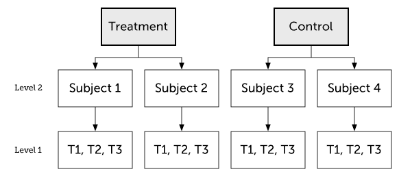
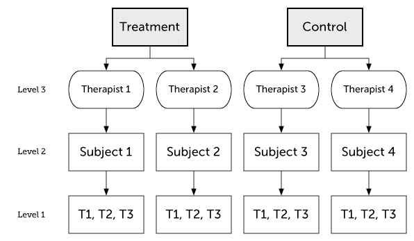

# Linear mixed effects models 4

## Learning goals

- Some worked examples. 
- Doing follow-up tests with the `emmeans` package
- Simulating, plotting, and analyzing models with different random effects structures
- Bootstrapping confidence intervals for fixed effects 

## Load packages and set plotting theme

```{r, message=FALSE}
library("knitr")       # for knitting RMarkdown 
library("kableExtra")  # for making nice tables
library("janitor")     # for cleaning column names
library("broom.mixed") # for tidying up linear mixed effects models 
library("lme4")        # for linear mixed effects models
library("afex")        # for ANOVAs
library("car")         # for ANOVAs
library("datarium")    # for ANOVA dataset
library("modelr")      # for bootstrapping
library("boot")        # also for bootstrapping
library("ggeffects")   # for plotting marginal effects
library("emmeans")     # for marginal effects
library("tidyverse")   # for wrangling, plotting, etc. 
```

```{r}
theme_set(theme_classic() + #set the theme 
            theme(text = element_text(size = 20))) #set the default text size

# knitr display options 
opts_chunk$set(comment = "",
               fig.show = "hold")

# suppress grouping warning messages
options(dplyr.summarise.inform = F)
```

## Load data sets

### Sleep data

```{r}
# load sleepstudy data set 
df.sleep = sleepstudy %>% 
  as_tibble() %>% 
  clean_names() %>% 
  mutate(subject = as.character(subject)) %>% 
  select(subject, days, reaction)

# add two fake participants (with missing data)
df.sleep = df.sleep %>% 
  bind_rows(tibble(subject = "374",
                   days = 0:1,
                   reaction = c(286, 288)),
            tibble(subject = "373",
                   days = 0,
                   reaction = 245))
```

### Reasoning data

```{r}
df.reasoning = sk2011.1
```

### Weight loss data

```{r}
data("weightloss", package = "datarium")

# Modify it to have three-way mixed design
df.weightloss = weightloss %>%
  mutate(id = rep(1:24, 2)) %>% 
  pivot_longer(cols = t1:t3,
               names_to = "timepoint",
               values_to = "score") %>% 
  arrange(id)
```

### Politness data

```{r}
df.politeness = read_csv("data/politeness_data.csv") %>% 
  mutate(scenario = as.factor(scenario))
```

## Follow-up tests with emmeans

Just like with the linear model `lm()`, we can use linear contrasts to test more specific hypotheses with `lmer()`. The `emmeans()` function from the `emmeans` package will be our friend. 

### Sleep study

Let's ask some more specific question aboust the sleep study. 

1. Do reaction times differ between day 0 and the first day of sleep deprivation? 
2. Do reaction times differ between the first and the second half of the study? 

Let's visualize the data first: 

```{r}
ggplot(data = df.sleep %>% 
         mutate(days = as.factor(days)),
       mapping = aes(x = days,
                     y = reaction)) + 
  geom_point(position = position_jitter(width = 0.1),
             alpha = 0.1) + 
  stat_summary(fun.data = "mean_cl_boot")
```

And now let's fit the model, and compute the contrasts: 

```{r}
fit = lmer(formula = reaction ~ 1 + days + (1 | subject),
           data = df.sleep %>% 
             mutate(days = as.factor(days)))

contrast = list(first_vs_second = c(-1, 1, rep(0, 8)),
                early_vs_late = c(rep(-1, 5)/5, rep(1, 5)/5))

fit %>% 
  emmeans(specs = "days",
          contr = contrast) %>% 
  pluck("contrasts")

df.sleep %>% 
  # filter(days %in% c(0, 1)) %>% 
  group_by(days) %>% 
  summarize(reaction = mean(reaction))

df.sleep %>% 
  mutate(index = ifelse(days %in% 0:4, "early", "late")) %>% 
  group_by(index) %>% 
  summarize(reaction = mean(reaction))
```

### Weight loss study

For the weight loss data set, we want to check: 

1. Whether there was a difference between the first two vs. the last time point. 
2. Whether there was a linear trend across the time points. 

Let's first visualize again: 

```{r}
ggplot(data = df.weightloss,
       mapping = aes(x = timepoint,
                     y = score,
                     group = diet,
                     color = diet)) + 
  geom_point(position = position_jitterdodge(dodge.width = 0.5,
                                  jitter.width = 0.1,
                                  jitter.height = 0),
             alpha = 0.1) + 
  stat_summary(fun.data = "mean_cl_boot",
               position = position_dodge(width = 0.5)) +
  facet_wrap(~ exercises) + 
  scale_color_brewer(palette = "Set1")

ggplot(data = df.weightloss,
       mapping = aes(x = timepoint,
                     y = score)) + 
  geom_point(position = position_jitter(width = 0.1),
             alpha = 0.1) + 
  stat_summary(fun.data = "mean_cl_boot") +
  scale_color_brewer(palette = "Set1")
```
And then fit the model, and compute the contrasts:

```{r}
fit = aov_ez(id = "id",
       dv = "score",
       between = "exercises",
       within = c("diet", "timepoint"),
       data = df.weightloss)

contrasts = list(first_two_vs_last = c(-0.5, -0.5, 1),
                 linear_increase = c(-1, 0, 1))

fit %>% 
  emmeans(spec = "timepoint",
          contr = contrasts)
```

Because we only had one observation in each cell of our design, the ANOVA was appropriate here (no data points needed to be aggregated). 

Both contrasts are significant. 

### Politeness study

For the politeness study, we'll be interested in one particular contrast: 

1. Was there an effect of attitude on frequency for female participants? 

Let's visualize first: 

```{r}
# overview of the data 
ggplot(data = df.politeness,
        mapping = aes(x = attitude,
                      y = frequency,
                      group = gender,
                      color = gender)) + 
  geom_point(position = position_jitter(width = 0.1),
             alpha = 0.1) + 
  stat_summary(fun.data = "mean_cl_boot") + 
  scale_color_brewer(palette = "Set1")

# variation across scenarios 
ggplot(data = df.politeness,
        mapping = aes(x = scenario,
                      y = frequency)) + 
  geom_point(position = position_jitter(width = 0.1),
             alpha = 0.1) + 
  stat_summary(fun.data = "mean_cl_boot") + 
  scale_color_brewer(palette = "Set1")

# variation across participants
ggplot(data = df.politeness,
        mapping = aes(x = subject,
                      y = frequency)) + 
  geom_point(position = position_jitter(width = 0.1),
             alpha = 0.1) + 
  stat_summary(fun.data = "mean_cl_boot") + 
  scale_color_brewer(palette = "Set1")
```

We fit the model and compute the contrasts. 

```{r, message=FALSE}
fit = lmer(formula = frequency ~ 1 + attitude * gender + 
             (1 + attitude | subject) + 
             (1 + attitude | scenario),
           data = df.politeness)

fit %>% 
  joint_tests()

fit %>% 
  emmeans(specs = pairwise ~ attitude + gender, 
          adjust = "none")
```

Here, I've computed all pairwise contrasts. We were only interested in one: `inf F - pol F` and that one is significant. So the frequency of female participants' pitch differed between the informal and polite condition. 

If we had used an ANOVA approach for this data set, we could have done it like so: 

```{r}
aov_ez(id = "subject",
       dv = "frequency",
       between = "gender",
       within = "attitude",
       data = df.politeness)
```

This approach ignores the variation across scenarios (and just computed the mean instead). Arguably, the `lmer()` approach is better here as it takes all of the data into account. 

## Mixtures of participants

What if we have groups of participants who differ from each other? Let's generate data for which this is the case.

```{r}
# make example reproducible 
set.seed(1)

sample_size = 20
b0 = 1
b1 = 2
sd_residual = 0.5
sd_participant = 0.5
mean_group1 = 1
mean_group2 = 10

df.mixed = tibble(
  condition = rep(0:1, each = sample_size), 
  participant = rep(1:sample_size, 2)) %>% 
  group_by(participant) %>% 
  mutate(group = sample(1:2, size = 1),
         intercept = ifelse(group == 1,
                            rnorm(n(), mean = mean_group1, sd = sd_participant),
                            rnorm(n(), mean = mean_group2, sd = sd_participant))) %>% 
  group_by(condition) %>% 
  mutate(value = b0 + b1 * condition + intercept + rnorm(n(), sd = sd_residual)) %>% 
  ungroup %>% 
  mutate(condition = as.factor(condition),
         participant = as.factor(participant))
```

#### Ignoring mixture

Let' first fit a model that ignores the fact that there are two different groups of participants. 

```{r}
# fit model
fit.mixed = lmer(formula = value ~ 1 + condition + (1 | participant),
                 data = df.mixed)

summary(fit.mixed)
```

Let's look at the model's predictions: 

```{r}
fit.mixed %>%
  augment() %>%
  clean_names() %>%
  ggplot(data = .,
         mapping = aes(x = condition,
                       y = value,
                       group = participant)) +
  geom_point(alpha = 0.5) +
  geom_line(alpha = 0.5) +
  geom_point(aes(y = fitted),
             color = "red") +
  geom_line(aes(y = fitted),
             color = "red")
```


And let's simulate some data from the fitted model: 

```{r}
# simulated data 
fit.mixed %>%
  simulate() %>%
  bind_cols(df.mixed) %>%
  ggplot(data = .,
         mapping = aes(x = condition,
                       y = sim_1,
                       group = participant)) +
  geom_line(alpha = 0.5) +
  geom_point(alpha = 0.5)
```

As we can see, the simulated data doesn't look like the data that was used to fit the model.  

#### Modeling mixture

Now, let's fit a model that takes the differences between groups into account by adding a fixed effect for `group`.

```{r}
# fit model
fit.grouped = lmer(formula = value ~ 1 + group + condition + (1 | participant),
                   data = df.mixed)

summary(fit.grouped)
```

Note how the variance of the random intercepts is much smaller now that we've taken the group structure in the data into account. 

Let's visualize the model's predictions:

```{r}
fit.grouped %>%
  augment() %>%
  clean_names() %>%
  ggplot(data = .,
         mapping = aes(x = condition,
                       y = value,
                       group = participant)) +
  geom_point(alpha = 0.5) +
  geom_line(alpha = 0.5) +
  geom_point(aes(y = fitted),
             color = "red") +
  geom_line(aes(y = fitted),
             color = "red")
```

And simulate some data from the model: 

```{r}
# simulated data 
fit.grouped %>%
  simulate() %>%
  bind_cols(df.mixed) %>%
  ggplot(data = .,
         mapping = aes(x = condition,
                       y = sim_1,
                       group = participant)) +
  geom_line(alpha = 0.5) +
  geom_point(alpha = 0.5)
```

This time, the simulated data looks much more like the data that was used to fit the model. Yay! 


```{r}
ggpredict(model = fit.grouped,
          terms = "condition") %>% 
  plot()

ggpredict(model = fit.mixed,
          terms = "condition") %>% 
  plot()
```


#### Heterogeneity in variance

The example above has shown that we can take overall differences between groups into account by adding a fixed effect. Can we also deal with heterogeneity in variance between groups? For example, what if the responses of one group exhibit much more variance than the responses of another group? 

Let's first generate some data with heterogeneous variance: 

```{r}
# make example reproducible 
set.seed(1)

sample_size = 20
b0 = 1
b1 = 2
sd_residual = 0.5
mean_group1 = 1
sd_group1 = 1
mean_group2 = 30
sd_group2 = 10

df.variance = tibble(
  condition = rep(0:1, each = sample_size), 
  participant = rep(1:sample_size, 2)) %>% 
  group_by(participant) %>% 
  mutate(group = sample(1:2, size = 1),
         intercept = ifelse(group == 1,
                            rnorm(n(), mean = mean_group1, sd = sd_group1),
                            rnorm(n(), mean = mean_group2, sd = sd_group2))) %>% 
  group_by(condition) %>% 
  mutate(value = b0 + b1 * condition + intercept + rnorm(n(), sd = sd_residual)) %>% 
  ungroup %>% 
  mutate(condition = as.factor(condition),
         participant = as.factor(participant))
```

Let's fit the model: 

```{r}
# fit model
fit.variance = lmer(formula = value ~ 1 + group + condition + (1 | participant),
                    data = df.variance)

summary(fit.variance)
```

Look at the data and model predictions: 

```{r}
fit.variance %>%
  augment() %>%
  clean_names() %>%
  ggplot(data = .,
         mapping = aes(x = condition,
                       y = value,
                       group = participant)) +
  geom_point(alpha = 0.5) +
  geom_line(alpha = 0.5) +
  geom_point(aes(y = fitted),
             color = "red") +
  geom_line(aes(y = fitted),
             color = "red")
```

And the simulated data: 

```{r}
# simulated data 
fit.variance %>%
  simulate() %>%
  bind_cols(df.mixed) %>%
  ggplot(data = .,
         mapping = aes(x = condition,
                       y = sim_1,
                       group = participant)) +
  geom_line(alpha = 0.5) +
  geom_point(alpha = 0.5)
```

The `lmer()` fails here. It uses one normal distribution to model the variance between participants. It cannot account for the fact that the answers of one group of participants vary more than the answers from another groups of participants. Again, the simulated data doesn't look like the original data, even though we did take the grouping into account. 

We will later see that it's straightforward in Bayesian models to explicitly model heterogeneity in variance. 

## Simulating different random effects structures  

The examples below are taken from [this post](https://rpsychologist.com/r-guide-longitudinal-lme-lmer#power-analysis-and-simulating-these-models). 

### Two-level model

```{r two-level-model, echo=FALSE, fig.cap="Two-level model", out.width="95%"}

```

#### Conditional model 

##### Simulate the data

```{r}
set.seed(1)

n_participants = 100
n_timepoints = 3
n_conditions = 2
p_condition = 0.5
b0 = 10
b1 = 10
sd_participant = 2
sd_residual = 1

df.data = tibble(participant = rep(1:n_participants, each = n_timepoints),
                 timepoint = rep(1:n_timepoints, times = n_participants),
                 intercept_participant = rep(rnorm(n_participants, sd = sd_participant), 
                                             each = n_timepoints)) %>% 
  group_by(participant) %>% 
  mutate(condition = rbinom(n = 1, size = 1, prob = p_condition)) %>% 
  ungroup() %>% 
  mutate(value = b0 + b1 * condition + intercept_participant + 
           rnorm(n_participants * n_timepoints, sd = sd_residual))
```

##### Plot the data 

```{r}
df.plot = df.data %>% 
  mutate(condition = factor(condition,
                            levels = c(0, 1),
                            labels = c("control", "treatment")),
         timepoint = as.factor(timepoint))

ggplot(data = df.plot,
       mapping = aes(x = timepoint,
                     y = value,
                     group = participant)) +
  geom_point(alpha = 0.5) +
  geom_line(alpha = 0.5) +
  facet_grid(~ condition) +
  labs(x = "timepoint")
```

##### Fit the model 

```{r}
fit = lmer(formula = value ~ 1 + condition + (1 | participant),
           data = df.data)

fit %>% 
  summary()
```

##### Simulate and plot new data

```{r}
set.seed(1)

fit %>% 
  simulate() %>% 
  bind_cols(df.data) %>% 
  mutate(condition = factor(condition,
                            levels = c(0, 1),
                            labels = c("control", "treatment")),
         timepoint = as.factor(timepoint)) %>% 
  ggplot(data = .,
         mapping = aes(x = timepoint,
                       y = sim_1,
                       group = participant)) +
  geom_point(alpha = 0.5,
             color = "blue") +
  geom_line(alpha = 0.5,
            color = "blue") +
  facet_grid(~ condition) +
  labs(x = "timepoint")

```

#### Conditional growth model 

##### Simulate the data

```{r}
set.seed(1)

n_participants = 100
n_timepoints = 3
n_conditions = 2
p_condition = 0.5
b0 = 10 # intercept 
b1 = 10 # condition
b2 = 2 # time 
b3 = 3 # interaction
sd_participant = 2
sd_time = 2
sd_residual = 1

df.data = tibble(participant = rep(1:n_participants, each = n_timepoints),
                 timepoint = rep(1:n_timepoints, times = n_participants),
                 intercept_participant = rep(rnorm(n_participants, sd = sd_participant), 
                                             each = n_timepoints),
                 time_participant = rep(rnorm(n_participants, sd = sd_time), 
                                             each = n_timepoints)) %>% 
  group_by(participant) %>% 
  mutate(condition = rbinom(n = 1, size = 1, prob = p_condition)) %>% 
  ungroup() %>% 
  mutate(value = b0 + intercept_participant + 
           b1 * condition + 
           (b2  + time_participant) * timepoint +  
           b3 * condition * timepoint +
           rnorm(n_participants * n_timepoints, sd = sd_residual))
```

##### Plot the data 

```{r}
df.plot = df.data %>% 
  mutate(condition = factor(condition,
                            levels = c(0, 1),
                            labels = c("control", "treatment")),
         timepoint = as.factor(timepoint))

ggplot(data = df.plot,
       mapping = aes(x = timepoint,
                     y = value,
                     group = participant)) +
  geom_point(alpha = 0.5) +
  geom_line(alpha = 0.5) +
  facet_grid(~ condition) +
  labs(x = "timepoint")
```

##### Fit the model 

```{r}
fit = lmer(formula = value ~ 1 + condition * timepoint + (1 + timepoint | participant),
           data = df.data)

fit %>% 
  summary()
```

##### Data with individual model predictions 

```{r}
df.plot = fit %>% 
  augment() %>% 
  mutate(condition = factor(condition,
                            levels = c(0, 1),
                            labels = c("control", "treatment")),
         timepoint = as.factor(timepoint))
         

ggplot(data = df.plot,
       mapping = aes(x = timepoint,
                     y = value,
                     group = participant)) +
  # geom_point(alpha = 0.5) +
  # geom_line(alpha = 0.5) +
  geom_point(mapping = aes(y = .fitted),
             alpha = 0.3,
             color = "red") +
  geom_line(mapping = aes(y = .fitted),
             alpha = 0.3,
             color = "red") +
  facet_grid(~ condition) +
  labs(x = "timepoint")
```

##### Data with overall model predictions 

```{r}
df.model = ggpredict(model = fit, 
                     terms = c("timepoint", "condition"),
                     type = "fixed") %>% 
  rename(timepoint = x,
         condition = group) %>% 
  mutate(condition = factor(condition,
                            levels = c(0, 1),
                            labels = c("control", "treatment")),
         timepoint = as.factor(timepoint))

ggplot(data = df.plot,
       mapping = aes(x = timepoint,
                     y = value,
                     group = participant)) +
  # geom_point(alpha = 0.2) +
  # geom_line(alpha = 0.2) +
  geom_ribbon(data = df.model,
              mapping = aes(ymin = conf.low,
                            ymax = conf.high,
                            y = predicted,
                            group = NA),
              fill = "red",
              alpha = 0.2) +
  geom_smooth(method = "lm",
              mapping = aes(group = NA),
              color = "blue") + 
  # geom_line(data = df.model,
  #           mapping = aes(y = predicted,
  #                         group = NA),
  #           color = "red",
  #           linewidth = 1) +
  # geom_point(data = df.model,
  #            mapping = aes(y = predicted,
  #                          group = NA),
  #            color = "red",
  #            size = 3) +
  facet_grid(~ condition) +
  labs(x = "timepoint")
```

##### Simulate and plot new data

```{r}
set.seed(1)

fit %>% 
  simulate() %>% 
  bind_cols(df.data) %>% 
  mutate(condition = factor(condition,
                            levels = c(0, 1),
                            labels = c("control", "treatment")),
         timepoint = as.factor(timepoint)) %>% 
  ggplot(data = .,
         mapping = aes(x = timepoint,
                       y = sim_1,
                       group = participant)) +
  geom_point(alpha = 0.5,
             color = "blue") +
  geom_line(alpha = 0.5,
            color = "blue") +
  facet_grid(~ condition) +
  labs(x = "timepoint")

```

### Three-level model 

```{r three-level-model, echo=FALSE, fig.cap="Three-level model", out.width="95%"}

```

##### Simulate the data

```{r}
set.seed(1)

n_participants = 100
n_therapists = 6
n_timepoints = 3
n_conditions = 2
p_condition = 0.5
b0 = 10 # intercept 
b1 = 10 # condition
b2 = 2 # time 
b3 = 3 # interaction
sd_intercept_therapist = 3
sd_intercept_participant = 2
sd_time_therapist = 2
sd_time_participant = 1
sd_residual = 1

df.data = tibble(participant = rep(1:n_participants, each = n_timepoints),
                 timepoint = rep(1:n_timepoints, times = n_participants),
                 intercept_participant = rep(rnorm(n_participants,
                                                   sd = sd_intercept_participant), 
                                             each = n_timepoints),
                 time_participant = rep(rnorm(n_participants, sd = sd_time_participant), 
                                             each = n_timepoints)) %>% 
  group_by(participant) %>% 
  mutate(condition = rbinom(n = 1, size = 1, prob = p_condition),
         therapist = ifelse(condition == 0, sample(x = 1:(n_therapists/2),
                                                   size = 1),
                        sample(x = ((n_therapists/2)+1):n_therapists,
                               size = 1))) %>% 
  ungroup() %>% 
  group_by(therapist) %>%
  mutate(intercept_therapist = rnorm(1, sd = sd_intercept_therapist),
         time_therapist = rnorm(1, sd = sd_time_therapist)) %>%
  ungroup() %>% 
  mutate(value = b0 + intercept_therapist + intercept_participant + 
           b1 * condition + 
           (b2 + time_therapist + time_participant) * timepoint +  
           b3 * condition * timepoint +
           rnorm(n_participants * n_timepoints, sd = sd_residual))
```

##### Plot the data 

```{r}
df.plot = df.data %>% 
  mutate(condition = factor(condition,
                            levels = c(0, 1),
                            labels = c("control", "treatment")),
         timepoint = as.factor(timepoint),
         therapist = as.factor(therapist))

ggplot(data = df.plot,
       mapping = aes(x = timepoint,
                     y = value,
                     group = participant,
                     color = therapist)) +
  geom_point(alpha = 0.5) +
  geom_line(alpha = 0.5) +
  facet_grid(~ condition) +
  labs(x = "timepoint")
```

##### Fit the model 

```{r}
fit = lmer(formula = value ~ 1 + condition * timepoint + 
             (1 + timepoint | therapist) + 
             (1 + timepoint | therapist:participant),
           data = df.data)

fit %>% 
  summary()
```

## Bootstrapping

Bootstrapping is a good way to estimate our uncertainty on the parameter estimates in the model. 

### Linear model

Let's briefly review how to do bootstrapping in a simple linear model. 

```{r}
# fit model 
fit.lm = lm(formula = reaction ~ 1 + days,
            data = df.sleep)

# coefficients
coef(fit.lm)

# bootstrapping 
df.boot = df.sleep %>% 
  bootstrap(n = 100,
            id = "id") %>% 
  mutate(fit = map(.x = strap,
                   .f = ~ lm(formula = reaction ~ 1 + days,
                             data = .x)),
         tidy = map(.x = fit, 
                    .f = tidy)) %>% 
  unnest(tidy) %>% 
  select(id, term, estimate) %>% 
  spread(term, estimate) %>% 
  clean_names() 
```

Let's illustrate the linear model with a confidence interval (making parametric assumptions using the t-distribution). 

```{r, message=FALSE}
ggplot(data = df.sleep,
       mapping = aes(x = days,
                     y = reaction)) + 
  geom_smooth(method = "lm") + 
  geom_point(alpha = 0.3)
```

And let's compare this with the different regression lines that we get out of our bootstrapped samples:

```{r}
ggplot(data = df.sleep,
       mapping = aes(x = days,
                     y = reaction)) + 
  geom_abline(data = df.boot,
              aes(intercept = intercept,
                  slope = days,
                  group = id),
              alpha = 0.1) +
  geom_point(alpha = 0.3)
```

### Linear mixed effects model 

For the linear mixed effects model, we can use the `bootmer()` function to do bootstrapping. 

```{r, message=F, warning=F}
set.seed(1)

# fit the model 
fit.lmer = lmer(formula = reaction ~ 1 + days + (1 + days | subject),
                data = df.sleep)

# bootstrap parameter estimates 
boot.lmer = bootMer(fit.lmer,
                    FUN = fixef,
                    nsim = 100)

# compute confidence interval 
boot.ci(boot.lmer,
        index = 2,
        type = "perc")
```

Let's plot the distribution of estimates.

```{r}
# plot distribution of estimates 
boot.lmer$t %>% 
  as_tibble() %>% 
  clean_names() %>% 
  mutate(id = 1:n()) %>% 
  pivot_longer(cols = -id,
               names_to = "index",
               values_to = "value") %>% 
  ggplot(data = .,
         mapping = aes(x = value)) + 
  geom_density() + 
  facet_grid(cols = vars(index),
             scales = "free") +
  coord_cartesian(expand = F)
```

And let's look at the predictions together with the data. 

```{r}
df.boot_lmer = boot.lmer$t %>% 
  as_tibble() %>% 
  clean_names() %>% 
  mutate(id = 1:n())

ggplot(data = df.sleep,
       mapping = aes(x = days,
                     y = reaction)) + 
  geom_abline(data = df.boot_lmer,
              aes(intercept = intercept,
                  slope = days,
                  group = id),
              alpha = 0.1) +
  geom_point(alpha = 0.3)
```

As you'll notice, once we take the dependence in the data into account, the bootstrapped confidence interval is wider than when we ignore the dependence. 


## Session info

Information about this R session including which version of R was used, and what packages were loaded. 

```{r}
sessionInfo()
```
